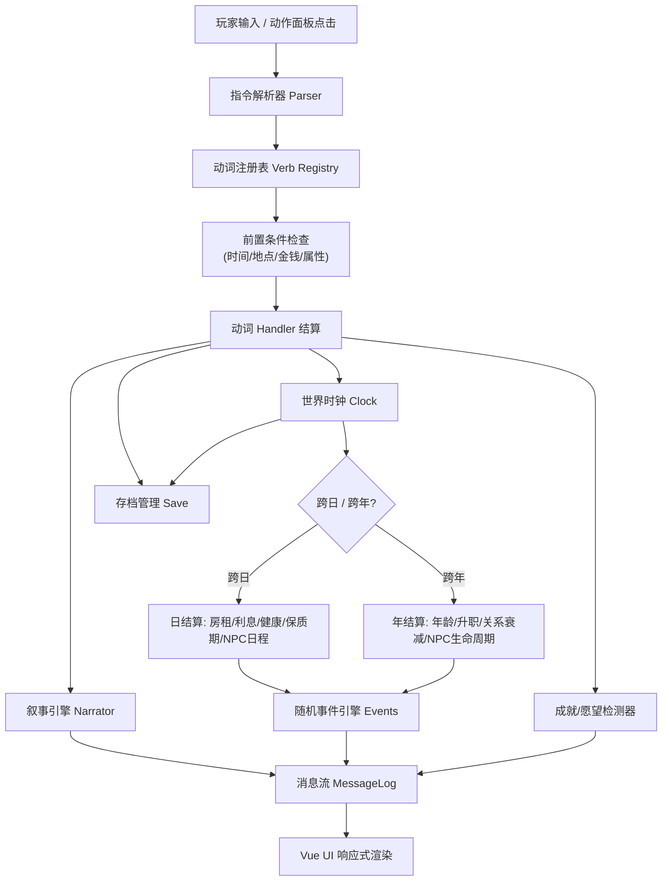

# 开放人生文字沙盒游戏 — 技术设计

Feature Name: life-text-sandbox
Updated: 2026-10-01

## Description

纯前端 H5 文字沙盒游戏。玩家通过中文自然语言式指令在模拟城市中自由生活。世界由指令解析器、规则引擎、内容数据三层驱动，无 AI、无后端、离线可玩。24 个需求模块（R1-R24）全部在一期实现。移动端优先适配，后续经 Capacitor 打包为安卓 App。

## 技术选型

| 层 | 选型 | 理由 |
|----|------|------|
| 构建 | Vite 5 | 快速 HMR，静态产物适合 Capacitor 封装 |
| 框架 | Vue 3 + `<script setup>` + TS | 游戏状态高频更新，响应式渲染成本最低 |
| 状态 | 单一 GameState 对象 + `reactive()` | 沙盒游戏状态强关联，集中管理优于分 store |
| 测试 | Vitest | 与 Vite 同生态，parser 与系统结算需要大量单测 |
| 存储 | localStorage + 版本化 schema | 满足 R18；APK 内 WebView 同样可用 |
| 样式 | 原生 CSS（CSS 变量主题） | 零依赖，移动端三区布局可控 |

## Architecture



核心原则：**引擎层（engine/）与内容层（content/）与界面层（ui/）完全分离**。引擎不 import 任何 Vue；内容全部为纯数据文件；打包安卓时仅替换 UI 宿主。

## Components and Interfaces

### 目录结构

```
src/
├── engine/
│   ├── Game.ts            # 门面：init / submitCommand / tick / save / load
│   ├── state.ts           # GameState / Player / NPC / Location 等类型定义
│   ├── clock.ts           # 世界时钟、日结算、年结算调度
│   ├── parser/
│   │   ├── tokenizer.ts   # 中文分词（按内容词库的最大匹配）
│   │   └── resolver.ts    # 动词→对象→参数 解析与模糊纠错
│   ├── verbs/
│   │   ├── registry.ts    # 动词注册表：name/aliases/params/handler
│   │   ├── move.ts        # 去/回家/打车/坐公交/开车
│   │   ├── consume.ts     # 吃/喝/用/买/卖
│   │   ├── time.ts        # 睡觉/等待
│   │   ├── growth.ts      # 学习/锻炼/考试/考证/上学
│   │   ├── work.ts        # 工作/找工作/辞职/加班
│   │   ├── finance.ts     # 存款/取款/贷款/还款/买股票/卖股票/买彩票
│   │   ├── estate.ts      # 租房/买房/卖房/装修
│   │   ├── business.ts    # 开店/进货/定价/营业/打烊/雇佣/解雇/发工资
│   │   ├── social.ts      # 聊天/送礼/请客/表白/求婚/结婚/要孩子/离婚
│   │   ├── health.ts      # 看病/买药/体检
│   │   ├── leisure.ts     # 游玩/看电影/上网/旅游/唱歌
│   │   ├── crime.ts       # 偷窃/抢劫
│   │   └── meta.ts        # 帮助/查看/愿望/存档/读档
│   ├── systems/
│   │   ├── economy.ts     # 物价波动、通胀、市场行情 (R21)
│   │   ├── stock.ts       # 股票随机游走 (R9)
│   │   ├── social.ts      # 关系衰减、八卦传播 (R12)
│   │   ├── npcLife.ts     # NPC 日程执行与生命周期 (R12)
│   │   ├── health.ts      # 疾病触发与病程 (R14)
│   │   ├── mood.ts        # 心情联动 (R15)
│   │   └── crime.ts       # 声望与司法 (R16)
│   ├── events/engine.ts   # 加权随机事件调度与选项分支 (R17)
│   ├── narrate.ts         # 模板选择与变量渲染 (R24)
│   ├── goals.ts           # 成就检测 + 愿望进度 (R22)
│   ├── legacy.ts          # 传承点数计算与天赋商店 (R23)
│   └── save.ts            # 序列化/版本迁移/localStorage
├── content/
│   ├── locations.ts       # 30+ 地点
│   ├── items.ts           # 100+ 物品
│   ├── jobs.ts            # 20+ 职业与晋升链
│   ├── skills.ts          # 技能/学历/证书
│   ├── npcs.ts            # 20+ NPC 与日程模板
│   ├── events.ts          # 80+ 事件
│   ├── stocks.ts          # 10+ 股票
│   ├── shops.ts           # 商店货架与定价
│   ├── texts/             # 叙事模板库（按动词分文件）
│   └── achievements.ts    # 100+ 成就
├── ui/
│   ├── App.vue            # 三区布局 + 移动端适配
│   ├── StatusBar.vue      # 时间/金钱/属性/天气
│   ├── MessageLog.vue     # 消息流（分类样式、可点击标记）
│   ├── InputBar.vue       # 输入框 + 补全 + 历史
│   ├── ActionPanel.vue    # 情境动作面板（免输入模式）
│   ├── OverviewTabs.vue   # 状态总览分页
│   └── modals/            # 开档设定/人生总结/传承商店/事件选项
└── main.ts
```

### 关键接口

```ts
// engine/state.ts（节选）
interface GameState {
  version: number;
  time: WorldTime;            // {year, month, day, minute, weekday}
  weather: Weather;
  player: Player;
  npcs: NPC[];
  market: MarketState;        // 物价系数表、通胀率
  stocks: StockState[];
  crime: { reputation: number; record: CriminalRecord[]; jailUntil?: WorldTime };
  events: { active?: ActiveEvent; cooldowns: Record<string, number> };
  stats: LifeStats;           // 人生统计：总收入/总支出/大事记
  meta: { seed: number; achievements: Set<string>; wishes: Wish[] };
}

interface VerbDef {
  name: string;
  aliases: string[];          // "g" → "去"
  category: VerbCategory;
  timeCost: (state, args) => number;
  check?: (state, args) => string | null;   // 返回失败原因，null 通过
  run: (state, args, rng) => void;          // 直接 mutate state
}

// engine/Game.ts（节选）
class Game {
  submitCommand(raw: string): void;   // R3 主入口
  tick(minutes: number): void;        // 时钟推进 + 日/年结算 + 事件
  serialize(): string;
  static deserialize(json: string): Game;
}
```

### 指令解析流程（R3）

1. **Tokenizer**：以内容词库（地名/物品名/NPC名/动词别名）做最大匹配分词，剩余按空格/数字切分
2. **Resolver**：动词别名归一 → 对象模糊匹配（编辑距离 ≤ 2 时提示"您是想…？"）→ 参数提取（数量/时长/金额）
3. **Check**：动词前置条件（在哪个地点、开放时间、金钱、体力、是否在监禁）
4. **Run**：Handler mutate GameState，经 `narrate()` 输出文本
5. **Post**：`tick(timeCost)` → 成就/愿望检测 → 自动存档

## Data Models

内容数据全部为 `as const` 纯对象，引擎启动时构建索引（名称→对象 Map）。

- **Location**: `{ id, name, aliases, district, openHours: [from, to], actions: string[], shop?: ShopId, description }`
- **Item**: `{ id, name, category, basePrice, effect?: AttrDelta, expiryDays?, durable?, licenseFor? }`
- **Job**: `{ id, title, salary, workHours, require: { education?, skills?, licenses? }, promotion?: jobId }`
- **NPC**: `{ id, name, gender, age, jobId, personality: string[], schedule: ScheduleSlot[], relationship: number, homeId, alive }`
- **GameEvent**: `{ id, weight, when: (state)=>boolean, text, options?: {label, effect}[], effects }`
- **Achievement**: `{ id, name, category, desc, check: (state)=>boolean, reward? }`
- **NarrativeTemplate**: `{ conditions: {time?, weather?, mood?, season?}[], texts: string[] }`

随机数：使用带 seed 的 PRNG（mulberry32），seed 入存档，保证同档行为可复现。

## Correctness Properties

1. **存档往返**：`deserialize(serialize(g))` 与 `g` 深等价（Vitest 属性测试覆盖）
2. **时间单调**：世界时钟在正常游玩流程中只增不减
3. **金钱守恒**：所有资金变动经由统一 `addMoney(delta, reason)`，账目与 stats 汇总一致
4. **死亡冻结**：`player.alive === false` 时 `submitCommand` 仅接受"查看/重新开档"
5. **内容引用完整**：启动时校验内容数据的交叉引用（地点 action 引用的动词必须已注册；事件效果引用的物品必须存在）
6. **存档版本迁移**：旧版本存档经 `migrations[]` 链式升级，迁移失败时提示而非崩溃

## Error Handling

| 场景 | 处理 |
|------|------|
| 指令无法解析 | 回复未识别 + 列出相近合法动词（R3.3） |
| 对象模糊匹配失败 | 提示"您是想…？"候选列表 |
| localStorage 已满/损坏 | 捕获异常，提示导出存档文本；损坏档提供"重开"而不崩溃 |
| 内容数据引用缺失 | 启动校验失败时在控制台定位具体文件，界面显示"内容加载异常" |
| 数值越界 | 属性统一 clamp(0, 100)，金额统一 `Math.round` |

## Test Strategy

- **parser**：每个动词 3+ 条正反用例（合法/对象错误/条件不满足）；模糊纠错用例
- **systems**：日结算/年结算快照测试；物价波动有界性；股票随机游走统计特征
- **save**：往返等价属性测试 + 3 个历史版本迁移测试
- **e2e 流程**：模拟"开档→学习→工作→存款→买房→结婚→死亡→传承"全链路脚本测试
- 运行：`npm run test`（Vitest watch）；构建校验：`npm run build`

## 安卓打包预留（R19 后续）

- `npm run build` 产物为纯静态文件
- 增加 `capacitor.config.ts` + `npx cap add android` 即可生成安卓工程；WebView 直接加载 dist，localStorage 原生可用
- 引擎层零 DOM 依赖，满足未来原生壳复用

## References

[^1]: 需求文档 - `当前工作区/.monkeycode/specs/life-text-sandbox/requirements.md`
