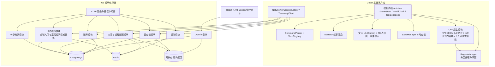
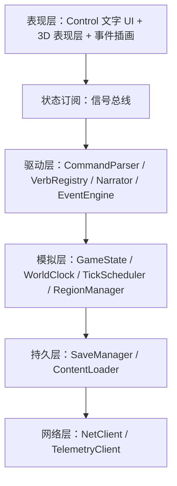
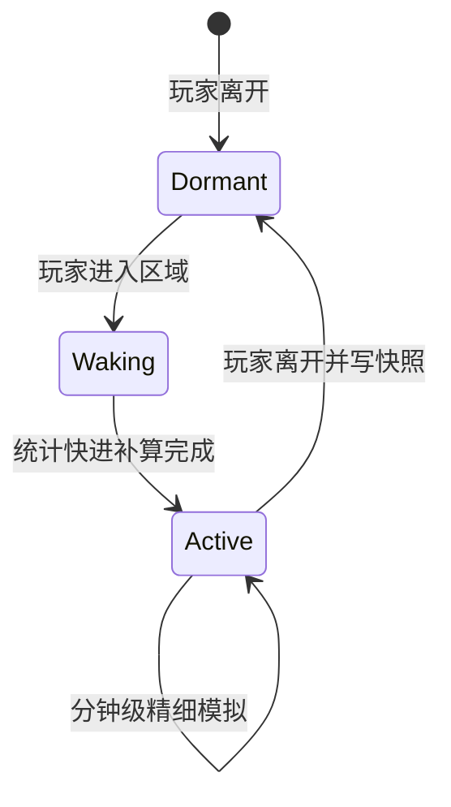
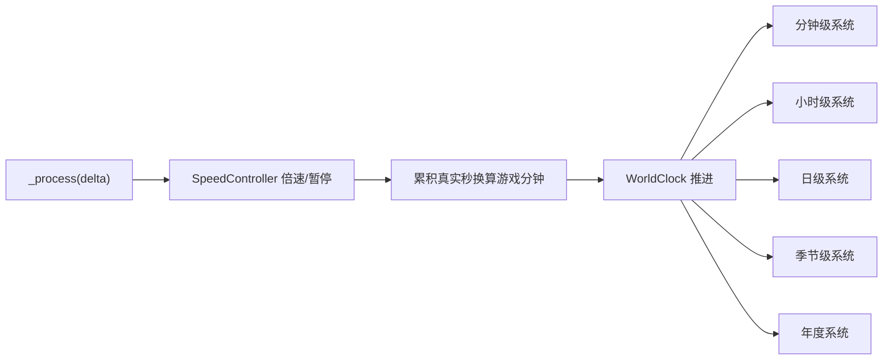
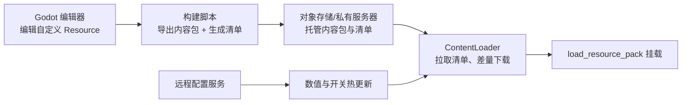
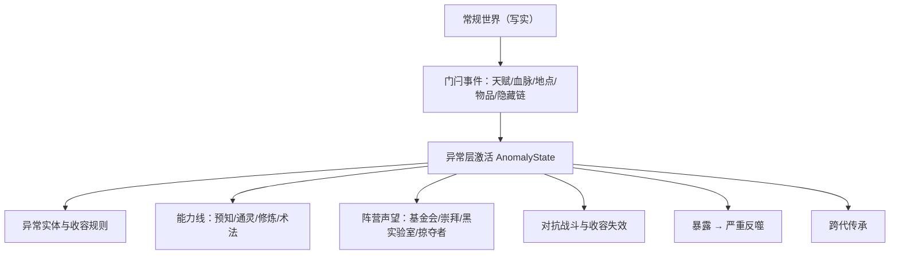

# 浮生录 — 技术设计

Feature Name: life-text-sandbox
Updated: 2026-10-04

## Description

《浮生录》是一款桌面端单人开放人生文字沙盒游戏。客户端基于 Godot 4 与 GDScript，玩法由文字驱动，表现层采用全 3D（主角使用 3D 模型、NPC 简化表现），插画用于关键事件与图鉴；内容以 Godot 自定义 Resource 组织，构建时打包为带版本与哈希的内容包，经私有服务器分发。游戏世界采用「活动区域精细模拟 + 休眠区域统计快进」的分区架构，世界按真实时间挂机自走，支持暂停与倍速。

后端基于 Go 模块化单体，配套 React + Ant Design 管理后台，提供账号、云存档、内容与远程配置、传承档案与遥测能力，数据层采用 PostgreSQL、Redis 与对象存储。客户端在离线时可完成全部单机游玩，联网时进行存档同步、内容更新与遥测上报。

本设计对应 requirements.md 中的 R1 至 R99，覆盖 50 个系统域，含一层隐秘异常体系，以及引擎定制、冲突战斗、世界记忆、事件调度与音频等横切系统。

## Architecture

### 总体架构



### 客户端分层

客户端严格分层，模拟内核不依赖任何 UI 节点，可在 headless 模式下运行与测试。



### 引擎定制

采用 **fork 仓库 + 锁版本 + 常合并上游**，改动优先级放在「模块」而非「核心」。

- **落地形态（已定）**：`engine/` 以 Git submodule 形式指向自有的 Godot fork，维护 `lifetext` 分支，基点锁定 4.7.x 的官方 tag；保留 `upstream` 镜像常合并，核心 diff 尽量趋近于零。
- **仓库布局（已定）**：overlay 模式——项目模块置于游戏仓库 `engine-modules/lifetext_*`，核心 patch 置于 `engine-patches/*.patch`，构建前覆盖进 Godot 源码树并 apply；`engine/` submodule 保持接近纯净，升级时只需处理 patch 文件。
- **改造分层（从浅到深）**：
  - A 不碰核心（首选，先做原型）：`EditorImportPlugin` 实现 CSV/Excel→Resource 导入、`ResourceFormatLoader/Saver` 自定义内容包与存档格式、GDExtension 承载热点。
  - B `modules/lifetext_*`（项目专用引擎的主体）：`lifetext_content`（列式二进制容器 + zstd、导入与加载）、`lifetext_crypto`（存档 AES-256-GCM + Argon2id、PCK 内建加密、完整性）、`lifetext_text`（CJK 排版与 IME 增强）、`lifetext_sim`（无状态批量内核：确定性数学与人口/经济热点，Packed 数组进出）。原型验证通过后冻结进模块。
- **模块 API 契约（已定）**：统一 `LT` 前缀 + API 版本常量，加载时校验版本不匹配即拒绝；暴露 `RefCounted` 实例、批量 Packed 数组进出、结构化结果（`{ok, code, message, data}`），禁止逐实体跨语言调用；契约写入 `engine-modules/README.md` 并纳入一致性测试。
  - C 少量核心 patch（模块无法实现时）：ResourceLoader 缓存与按需卸载、渲染特性裁剪、headless 优化；每个 patch 独立 commit 并写明理由，便于 rebase。
  - D 彻底替换核心：本项目不做。
- **落地节奏（已定）**：先以 GDExtension + 编辑器插件做原型，验证内容格式、加密、文本三块；稳定后再冻结进 `modules/lifetext_*` 并建自定义导出模板。日常开发继续使用官方引擎。
- **平台与构建（已定）**：首发平台为 Windows，CI 采用 GitHub Actions 托管 runner（windows-latest 出 Windows 导出模板，ubuntu-latest 出 editor 与 headless），产物缓存；macOS/Linux 模板按需再补，本机不承担全量 SCons 编译。
- **自定义构建**：裁剪无用模块、按需开启 LTO 减小体积；编辑器、导出模板、headless 三目标由 CI 构建并缓存。
- **维护机制**：`upstream` 镜像 + `lifetext` 分支，锁 `4.x.y` 按 tag 小步 merge；模块尽量多、核心 patch 尽量少以降低合并冲突；引擎升级以 CI 全绿为准。
- **何时才考虑完全独立**：上游停止维护、需要根本性替换渲染或脚本核心、或有专职引擎团队。

### 引擎运行时架构

- **渲染后端**：Forward+。玩法为 2D Control 文字 UI，表现层为全 3D（主角 3D 模型、NPC 简化表现），插画用于关键事件与图鉴；RTX 4070 下可开高画质与光影。
- **线程模型**：独立模拟线程计算世界，双缓冲把状态快照交给主线程渲染；输入与 UI 在主线程，模拟线程为单写者以保证确定性。
- **内容资源（混合）**：核心内容用 Godot Resource，便于编辑器编辑与引用；海量同构内容用自定义二进制容器，配自定义 `ResourceFormatLoader` 解码为轻量结构，加载更快、体积更小。容器采用列式数据块 + 字符串池 + zstd，带版本头与哈希（已定）。
- **原生与脚本边界（已定）**：C++ 为无状态批处理内核（批量属性衰减、人口队列统计、经济清算、关系矩阵批算），输入输出均为 Packed 数组、无全局可变状态；模拟状态以 GDScript 为源（便于存档与单测），GDScript 另承载内容规则、事件逻辑、指令解析与 UI。
- **确定性**：模拟线程按分级固定步长推进（活动区 20Hz、邻近 1Hz、远方按日批算，渲染帧与模拟解耦），随机数按流隔离并统一采用 SplitMix64（见 `shared/consistency/`），便于回放、离线补算与跨语言一致性测试。跨实现一致的部分采用整数/定点运算，浮点仅用于表现与纯本地瞬时量。
- **表现层（全 3D）**：主角使用 3D 模型与动画，NPC 采用简化表现，插画用于关键事件与成就图鉴；玩法文本与 3D 表现解耦。
- **中文支持**：启用高级 TextServer 与 ICU（断行、双向文本），内置思源黑体（正文）与思源宋体（标题），OFL 授权并做字形子集化控制体积；最早期验证中文输入法（IME）开启、候选词定位与 `ime_text` 处理。
- **内容包更新**：采用 Godot PCK patch 机制配合哈希校验，实现 30GB 内容的分片差量与热更新。
- **插件策略**：测试用 GUT/GdUnit4，NPC 行为用行为树插件，对话与剧情用对话插件；核心模拟与游戏规则自研，降低关键路径对外部依赖的绑定。
- **版本策略（保守小步）**：以实施时最新稳定 4.x 为基准，避开 dev/beta；仅在关键 bug 或必要特性时升级，小步进行且 CI 全绿再合，不追未稳定的 5.0。
- **3D 场景（局部加载，已定）**：表现层以「当前场所」为单位构建局部 3D 场景，进入时加载、离开时卸载，配异步加载与资源缓存池；不做无缝开放世界流式加载。场所之间的空间关系由 2D 缩放地图表达，跨场所移动通过地图操作或文字指令触发快速切换。
- **主角表现**：骨架动画 + 换装 + 有限塑形（有限比例/骨骼调整），控制资产量。
- **NPC 表现**：简化 3D 网格配 `MultiMeshInstance3D`/GPU instancing 批量绘制，远景降级为公告板或隐藏。
- **资产管线**：Blender 建模、glTF 2.0（.glb）交换、生成 LOD；纹理用 Substance/Material Maker；绑定借助 AccuRig/Mixamo。
- **输入**：键鼠 + 手柄，快捷键可配置，中文输入依赖 IME。
- **日志与诊断**：本地滚动日志；崩溃经引擎崩溃钩子捕获，可选匿名上报，与遥测开关一致。

### 3D 探索与交互

- **移动**：在**当前场所的局部 3D 场景**内以直接操控为主（WASD/手柄）；文字指令（「去/前往/回家」）触发跨场所切换或快进式移动。
- **相机**：第一人称与第三人称可自由切换。
- **交互**：靠近可交互物时出现提示，按键或文字指令触发对应动作。
- **与文字沙盒结合**：空间探索与位移在 3D 中完成，人生行为、系统操作与复杂指令仍以文字与面板为主，两者共享同一 `GameState`。

### 混合权威

- **客户端权威**：玩法规、玩家行为与资产、本地精细区域模拟、本地 NPC，以及由宏观派生的本地价格；离线可正常游玩。
- **后端权威**：全球人口聚合（国家→城市队列，其余国家仅维护总量指标）、全球宏观指标（通胀、基准利率、汇率基准、经济周期相位）、全球事件与新闻、云存档、传承、内容分发与遥测。
- **离线推进（已定）**：客户端用与后端相同的确定性模型和种子推进宏观近似，并记录 `server_tick` 锚点，保证离线体验连续。
- **上线合并（已定）**：宏观以服务器为准、客户端重基准；玩家与精细区域变更保留，按时间锚点对齐；跨端一致部分用 `shared/consistency` 向量兜底。
- **后端为精简模型**：只做统计与聚合，不做逐帧模拟。
- **世界模拟时钟（已定）**：宏观建模为 `f(world_seed, tick, 全局事件日志)`，后端按需从最近检查点批量迭代到请求 tick，客户端离线用同一函数近似推进；快进即请求更大的 tick，在线与离线结果一致。
- **一致性**：Go 与 GDScript、C++ 三端共享同一份规格与 `shared/consistency` 向量，对同一输入校验输出，防止逻辑漂移。

### 分区休眠模拟



- 每个区域持有 `RegionState`（人口、经济、关系、事件冷却）与 `lastSimulatedMinute`。
- 活动区域每游戏分钟执行完整结算。
- 休眠区域仅保存快照，不参与逐帧循环。
- 唤醒时调用 `RegionManager.wake(regionId, elapsedMinutes)`，按统计模型批量补算个体生命周期、关系衰减、经济与事件，补算成本与 elapsed 近似线性。

### 时间与分层调度



`TickScheduler` 注册各系统及其频率，`WorldClock` 跨过边界时按序派发，避免系统各自计时造成漂移。

### 内容与远程配置管线



### 隐藏异常层（D44）

异常层与主世界隔离，作为独立的隐藏状态树挂在 `GameState.anomaly`，默认不参与常规结算。



- 异常实体带分级、收容等级、危害类型与规律，玩家可研究、利用或违反收容规则。
- 异常战斗使用独立结算：能力等级、法器、气运与认知抗性参与判定。
- 暴露反噬走独立事件链：收容、猎杀、封禁、认知污染、精神崩溃，可接入 D4 精神疾病。
- 异常数据默认不写入普通界面；仅当局内接触后开放异常图鉴。

### 跨域接口与权威边界（R52）

横切全部 50 个域，统一三件事，避免各域私藏字段与权威漂移：

- **统一修饰符字典**（`client/sim/modifiers.gd`）：天气、交通/物流中断、罢工、数据泄露、能源价格、需求、荣誉、犯罪率、疫情、医疗承载力等以 `weather.rain` / `strike.logistics` / `energy.price` / `health.epidemic` 形式登记，模式为 `add`/`mul`/`set`，带来源与过期分钟。跨域事件只写修饰符，消费域按 `apply(base, key, now)` 取值，`KNOWN_KEYS` 为内容与事件必须引用的权威命名。
- **逐域权威登记**（`client/sim/authority.gd`）：每域声明 `authority`（client/server/shared）、`offline`（是否允许离线近似）、`policy`（server_wins / client_wins / server_if_present）与 `anchor`（`absolute_minutes`）。上线按 `merge(local, server)` 逐域裁决并透传锚点，全球人口与宏观指标由服务端覆盖，本地精细玩法保留。
- **领域休眠补算**（`client/sim/domain_wake.gd`）：`RegionManager.wake` 除区域人口/经济统计快进外，注入 `domain_wake` 后同步推进案件、灾害、在建工程、逾期催收、异常暴露、手术/试验等条目，规则确定性且满足**时间守恒**（累计推进分钟等于休眠窗口）与**幂等**（同点重复推进不改变状态）。

## Components and Interfaces

### 客户端组件

| 组件 | 职责 | 关键接口 |
|------|------|----------|
| `GameState` | 单一状态对象，承载玩家、NPC、区域、经济 | `get_state()` / 序列化 |
| `WorldClock` | 绝对分钟时间真源与日历派生 | `advance(minutes)` / `calendar()` |
| `TickScheduler` | 注册并派发分层结算 | `register(system, tier)` / `tick(minute)` |
| `SpeedController` | 暂停与倍速控制 | `set_speed(level)` / `get_speed()` |
| `RegionManager` | 区域激活、休眠与唤醒 | `enter(regionId)` / `wake(id, elapsed)` |
| `CommandParser` | 中文指令解析 | `parse(raw) -> ParsedCommand` |
| `VerbRegistry` | 动词注册与别名归一 | `register(def)` / `match_prefix(text)` |
| `Narrator` | 模板选择与变量渲染 | `render(context, vars) -> String` |
| `EventEngine` | 加权事件触发与选项结算 | `roll(region, minute)` / `choose(id, option)` |
| `SaveManager` | 本地存档读写与迁移 | `save(state)` / `load() -> GameState` |
| `ContentLoader` | 清单获取与内容包挂载 | `sync_manifest()` / `mount(pack)` |
| `NetClient` | REST 调用与令牌管理 | `request(path, body)` |
| `TelemetryClient` | 遥测缓存与上报 | `track(event)` / `flush()` |

### 后端模块

| 模块 | 职责 | 主要接口 |
|------|------|----------|
| 账号模块 | 注册、登录、令牌、设备绑定 | `POST /api/auth/register` `POST /api/auth/login` `POST /api/auth/refresh` |
| 云存档模块 | 存档读写、版本、冲突解决 | `GET /api/saves` `PUT /api/saves/{slot}` `POST /api/saves/{slot}/rollback` |
| 内容模块 | 内容清单与内容包地址 | `GET /api/content/manifest` |
| 配置模块 | 远程配置与公告下发 | `GET /api/config` `GET /api/announcements` |
| 传承模块 | 传承档案读写 | `GET /api/legacy` `PUT /api/legacy` |
| 遥测模块 | 事件接收与聚合 | `POST /api/telemetry/events` |
| Admin 模块 | 管理后台接口 | `GET /api/admin/accounts` `POST /api/admin/content/publish` 等 |

### 关键接口定义

```gdscript
# 指令解析
class ParsedCommand:
    var verb: String
    var tokens: Array
    var targets: Dictionary
    var numbers: Array
    var raw: String

# 区域唤醒
func wake(region_id: String, elapsed_minutes: int) -> void:
    var region := _regions[region_id]
    if region.state == RegionState.ACTIVE:
        return
    _fast_forward(region, elapsed_minutes)
    region.last_simulated_minute = world_clock.total_minutes
    region.state = RegionState.ACTIVE
```

## Data Models

### 客户端核心类型

- `GameState`：`version`、`time`、`weather`、`player`、`regions`、`stocks`、`events`、`stats`、`meta`、`seed`
- `Player`：`name`、`gender`、`age`、`attrs`（生理/心理/能力五组）、`skills`、`education`、`licenses`、`job`、`money`、`assets`、`family`、`relations`、`legal`、`health`、`memory`、`pets`、`military`、`disabilities`、`lands`、`digital_assets`、`cases`、`orders`、`itineraries`、`awards`、`medical_records`、`credit_score`、`will`
- `RegionState`：`id`、`level`（国/省/市/区/街/建筑）、`population`、`economy`、`price_index`、`safety`、`climate`、`locations`、`npcs`、`last_simulated_minute`、`state`、`environment`、`healthcare`、`infrastructure`、`unemployment`、`crime_rate`、`education_level`
- `NPC`：`id`、`name`、`gender`、`age`、`job`、`traits`、`schedule`、`relations`、`home`、`alive`、`memory`、`family`、`personality`、`health`、`military`
- `Relation`：`favor`、`trust`、`awe`、`grudge`、`intimacy`
- `Item`：`id`、`name`、`category`、`base_price`、`effect`、`expiry_days`、`durable`
- `Job`：`id`、`title`、`industry`、`salary`、`hours`、`require`、`promotion`
- `GameEvent`：`id`、`type`、`weight`、`conditions`、`duration`、`effects`、`options`
- `Achievement`：`id`、`category`、`desc`、`check`、`reward`
- `NarrativeTemplate`（Resource）：`conditions`、`texts`、`variables`
- `CommandIntent`：`verb`、`objects`、`params`、`source`（text/panel/hotkey）、`raw`
- `CommandOption`：`index`、`label`、`target`、`reason`
- `Legacy`：`talents`、`lineage`、`history`、`unlocks`

领域实体 schema（`shared/schemas/`）：`case`（案件）、`disaster`（灾害与救援）、`anomaly`（异常收容）、`factory`（经营）、`ip`（文娱 IP）、`sports`（体育联赛）、`org`（组织）、`order`（订单与物流）、`itinerary`（行程）、`medical`（就医）、`project`（工程/科研）、`event`（统一世界事件与修饰符）、`awards`（奖项）。存档 `world_delta` 按域持有这些实体数组，`schema_version` 迁移见 `client/sim/save_migrations.gd`。

### 后端数据模型

| 表 | 关键字段 |
|----|----------|
| `accounts` | id、username、password_hash、created_at |
| `devices` | id、account_id、device_name、token、last_seen |
| `saves` | id、account_id、slot、version、hash、object_key、created_at |
| `save_versions` | id、save_id、version、object_key、created_at |
| `content_packs` | id、name、version、hash、size、object_key、published_at |
| `remote_config` | key、value、version、updated_at |
| `announcements` | id、title、body、start_at、end_at |
| `legacy` | account_id、talents、lineage_data、history_data、unlocks、updated_at |
| `telemetry_events` | id、account_id、event_type、payload、created_at |

### 内容清单

```json
{
  "manifest_version": 12,
  "packs": [
    { "name": "core", "version": "1.4.0", "hash": "sha256:...", "size": 104857600, "url": "/packs/core-1.4.0.pck" },
    { "name": "art-city-a", "version": "2.1.0", "hash": "sha256:...", "size": 734003200, "url": "/packs/art-city-a-2.1.0.pck" }
  ]
}
```

## Numeric Models

所有公式由远程配置覆盖默认值。属性统一 clamp 到定义区间。

| 模型 | 公式与规则 | 对应需求 |
|------|------------|----------|
| 日历 | 1 日 = 1440 分钟；真实公历（含 365/366 闰年与各月天数） | R1 |
| 饱食衰减 | `hunger -= hunger_decay_per_hour * hours`；归零后 `health -= starve_dps` | R7 |
| 口渴衰减 | 速率高于饱食；归零后健康下降更快 | R7 |
| 睡眠债 | 夜间未睡累积；超过阈值降低智力与心情 | R7 |
| 营养 | 五项指标按食物构成更新；长期失衡提高对应疾病权重 | R43 |
| 成瘾 | `craving += dose * potency`；戒断期 `mood/will -= withdrawal` | R43 |
| 人格 | 五维 0-100；标签由阈值派生；重大事件可微调 | R44 |
| 幸福 | `happiness = w1*relation + w2*career + w3*health + w4*faith + w5*meaning` | R44 |
| 技能经验 | `xp += practice * int_mod * will_mod * (1-fatigue) * talent_mod`；`need(n) = base*n^1.5`；0..20 级 | R10, R45 |
| 股价 | GBM：`S *= exp((mu - 0.5*sigma^2)*dt + sigma*sqrt(dt)*Z)` | R48 |
| 通胀传导 | `price *= (1 + inflation_rate)`；工资滞后一季调整 | R48 |
| 个税 | 超额累进；年结算汇算清缴 | R48 |
| 关系衰减 | 年结算 `dim *= exp(-k * idle_years)` | R18 |
| 唤醒补算 | `wake_cost ~= c * elapsed_minutes`；幂等，时间守恒 | R5 |
| 寿命 | `lifespan = base + health_hist + medical + luck - disease_load` | R12 |
| 价值观漂移 | 重大选择 `axis += delta * will_mod`，clamp 到 0-100 | R55 |

## Domain Design Notes

| 域 | 设计要点 |
|----|----------|
| D1 | 气候带 Resource 绑定区域；天气状态机派生连续气象；时代阶段为全局枚举，内容带 `era_min/era_max` |
| D2 | 地图为 Control 叠加标记；枢纽为加权有向图，路径用 Dijkstra；场所类型为 Resource |
| D3 | 营养五项独立于饱食；成瘾五类共用 `AddictionState`；临终锁定大部分动词，开放遗嘱与告别 |
| D4 | 人格与标签分表；精神疾病复用疾病引擎；幸福与意义感日结算 |
| D5 | 技能树按领域分包；科研产出可写回时代解锁；艺术/体育有伤病与评价子系统 |
| D6 | 形象属性影响魅力修正；医美为带恢复期的事件链 |
| D7 | 军旅为职业树特例，限制民事动词；职场关系挂在同事 NPC 上；融资轮次为公司状态机 |
| D8 | 价格引擎统一入口；税目表可远程配置；宏观变量按季度 tick 更新并向下传导 |
| D9 | 物品目录无上限；房产为资产子类型含贷款与出租；网络消费走订单与物流 tick |
| D10 | 网络社交为虚拟场所；NPC 记忆为有上限的条目队列；活动区域人口全模拟，休眠区只留快照 |
| D11 | 子女为特殊 NPC；继承走遗嘱或法定规则；宠物为伴生实体 |
| D12 | 民事与刑事共用案件状态机；监狱为特殊区域；律师为技能修正 |
| D13 | 从政为职业树；宗教为社区与禁忌修饰器；移民切换国家法律与税表 |
| D14 | 娱乐活动 Resource 不少于 100；旅行为多日行程状态机 |
| D15 | 三条价值观轴写入决策权重；精神追求为可重复活动，产出意义感 |
| D16 | 国际关系状态机驱动征兵与战争经济；前线为高风险特殊区域 |
| D17 | 传染病用 SEIR 简化模型在区域间扩散；政策为宏观修饰器 |
| D18 | 七类设施账单与中断旗标，挂在住所与城市 |
| D19 | 组织为带成员与任务的实体；秘密组织暴露走法律事件 |
| D20 | 语言等级为技能树；节日为日历事件表；文化工业复用创业与作品 |
| D21 | 残障为持久状态修正动词可用性；养老院为特殊住所 |
| D22 | 作物与牲畜为季节 tick 生产链；土地为资产子类型 |
| D23 | 黑客为犯罪技能树特例；电竞直播为生涯路径 |
| D24 | 内容带时代门闩；气候用年尺度慢变量 |
| D25 | IP 为可交易资产；侵权走诉讼状态机；媒体机构复用公司 |
| D26 | 工厂为生产链实体：原料→产线→质检→交付，受基础设施中断影响 |
| D27 | 贸易为跨境订单+关务结算；关税与航线受 D16 影响 |
| D28 | 矿权与开采为高风险生产链；能源价格为宏观变量输入 |
| D29 | 渔林猎复用第一产业季节 tick，叠加许可与安全掷骰 |
| D30 | 餐饮为门店经营特例，叠加食安与口碑因子 |
| D31 | 时尚复用品牌与作品系统，叠加真伪鉴定 |
| D32 | 体育为生涯路径+俱乐部经营，丑闻走法律与禁赛 |
| D33 | 大型活动为一次性工程：报批→票务→安保→结算 |
| D34 | 荣誉为评审规则引擎，黑幕为可曝光的隐蔽标记 |
| D35 | 警务与刑侦为公职路径+案件状态机；安保公司复用公司 |
| D36 | 应急为事件响应系统，响应时间影响伤亡 |
| D37 | 碳排为企业属性，碳交易为市场；污染为区域修正器 |
| D38 | 市政为城市级设施，可养护、施工、特许经营 |
| D39 | 借贷与典当复用金融；灰色催收触发法律与人身风险 |
| D40 | 消费保护为订单后置状态机：投诉→调解→维权 |
| D41 | 收养寄养为家庭状态迁移；慈善复用组织 |
| D42 | 殡葬由死亡流程触发，器官捐献为生前登记 |
| D43 | 玄学为服务与话术系统，产出安慰，不改变因果 |
| D44 | 异常体系与主世界隔离：独立隐藏状态树、门闩事件、异常实体与收容规则、隐秘阵营声望、暴露反噬与跨代传承；默认对常规系统不可见 |
| D45 | 医疗深化为基础就医的扩展：分科与手术状态机、移植与辅助生殖伦理门、医药研发管线 |
| D46 | 文娱复用作品与发行引擎，叠加平台分成与舆情下架 |
| D47 | 工程为招投标+施工周期实体；城市规划为区域级长期修正器 |
| D48 | 专业服务复用公司与资质系统，叠加执业风险 |
| D49 | 生活服务复用门店与订单，与养育、养老、宠物打通 |
| D50 | 基建国投为长期工程，投用后写入区域可达性与地价 |

## Content Targets

首个可玩版本内容下限见 R56。内容以 Godot Resource 分包：`core`（规则与词库）、`world`（地理与地点）、`life`（职业物品事件）、`art`（插画与 3D）。
内容条目基线见 `content-catalog.md`，指令动词基线见 `verb-registry.md`。
资源总体积目标 30GB：`art` 包按城市/主题拆分，单包建议 200MB–2GB，客户端按访问区域差量下载并本地缓存。
金手指库：首发 60+、长期 300+（可选元层，详见「金手指系统」）。

## UI Inventory

客户端 UI 的完整 token、主题、面板、弹窗与无障碍规格见 `当前工作区/.monkeycode/specs/life-text-sandbox/ui.md`。

| 界面 | 组成 | 对应需求 |
|------|------|----------|
| 开档设定 | 姓名、性别、出生地、家境、天赋 | R32, R57 |
| 主界面 | 状态栏、消息流、输入栏、动作面板 | R35, R57 |
| 状态总览 | 属性/技能/资产/背包/关系/职业/家庭/店铺/成就/图鉴/传承/地图 | R57 |
| 弹窗 | 事件选项、交易、对话、审判、临终、人生总结、传承结算 | R57 |
| 地图旅行 | 缩放地图、枢纽路径、行程 | R42, R54 |
| 存档 | 本地槽位、云同步、导出 | R33, R58 |
| 设置帮助 | 倍速、字号、对比度、色盲配色、键位、朗读、情境帮助 | R34, R59 |
| 经营面板 | 工厂/贸易/餐饮/俱乐部/公司产线与订单 | R70, R71, R74, R76 |
| 组织面板 | 工会/NGO/俱乐部/阵营与任务 | R63, D44 |
| 异常面板 | 异常图鉴、收容等级、能力线、法器、阵营声望（仅接触后可见） | R88 |
| 金手指面板 | 任务、积分商城、签到抽奖、属性可视化、空间/合成（启用金手指模式后可见） | R57, R100 |

状态栏常驻：时间、金钱、健康、心情、天气、病情。消息流按类型着色，地点/物品/NPC 可点击。

## API Specification

完整定义见 `当前工作区/shared/openapi/openapi.yaml`（OpenAPI 3.1），通用约定见 `当前工作区/shared/conventions.md`。前缀统一 `/api/v1`，JSON，Bearer Token（access JWT + 可撤销 refresh 存 Redis）。错误体 `{ code, message, details?, request_id }`，错误码表见 conventions.md 第 6 节。

| 方法 | 路径 | 说明 |
|------|------|------|
| POST | `/api/v1/auth/register` | 注册 |
| POST | `/api/v1/auth/login` | 登录，返回 access/refresh |
| POST | `/api/v1/auth/refresh` | 刷新令牌（轮换 refresh） |
| POST | `/api/v1/auth/logout` | 登出并撤销当前 refresh |
| GET | `/api/v1/saves` | 列出存档槽（游标分页） |
| PUT | `/api/v1/saves/{slot}` | 上传存档（对象存储 + 元数据，乐观锁 + 幂等键） |
| GET | `/api/v1/saves/{slot}` | 下载最新存档 |
| GET | `/api/v1/saves/{slot}/versions` | 列出历史版本 |
| POST | `/api/v1/saves/{slot}/rollback` | 回滚到指定版本 |
| POST | `/api/v1/saves/{slot}/resolve` | 解决本地/云端冲突 |
| GET | `/api/v1/content/manifest` | 内容清单（ETag） |
| GET | `/api/v1/config` | 远程配置（ETag） |
| GET | `/api/v1/announcements` | 公告 |
| GET/PUT | `/api/v1/legacy` | 传承读写 |
| POST | `/api/v1/telemetry/events` | 批量遥测（按 event_id 去重） |
| GET | `/api/v1/world/summary` | 全球人口与宏观摘要（ETag） |
| POST | `/api/v1/world/sync` | 上传本地近似并合并权威结果 |
| GET | `/api/v1/admin/accounts` | 账号管理 |
| POST | `/api/v1/admin/content/publish` | 发布内容包 |
| PUT | `/api/v1/admin/config` | 编辑远程配置 |

云存档冲突：比较 `version` 与 `hash`，返回 409（`SAVE_CONFLICT`）与双方摘要，客户端展示对比后由玩家选择保留、覆盖或合并。

存档 schema 顶层字段：`meta`（schema_version、game_version、content_version、playthrough_id、seed、created_at、updated_at、config、hash）、`clock`、`player`、`world_delta`、`rng`、`legacy`；数据模型见 `shared/schemas/save.schema.json`。

## Non-Functional Design

| 项 | 目标 | 实现要点 |
|----|------|----------|
| 帧率 | 稳定 60 FPS 起，支持高刷 | 开 V-Sync 并配合 G-Sync/FreeSync，FPS 上限按 `refresh − refresh²/3600` 设定（170Hz ≈ 161），可在设置调整；单帧 tick 上限，超限批量结算；UI 与模拟解耦 |
| 显示适配 | 高刷新率 + NVIDIA | Forward+ 基于 Vulkan，兼容 NVIDIA 驱动；内置上采样为 AMD FSR 1.0/2.2（仅 Forward+），DLSS 与 Reflex 需第三方 GDExtension |
| 唤醒成本 | 与休眠时长近似线性 | 统计快进，禁止逐分钟回放 |
| 内存 | 活动区域精细、其余快照 | NPC 细节仅在活动区域展开 |
| 同屏 NPC | 100+ | 简化 3D + 实例化渲染，按距离与重要性分级细节与更新频率 |
| 离线 | 完整单机 | 本地权威模拟；联网只同步 |
| 语言 | 中文默认 | 文本走 Resource，可扩语言包 |
| 无障碍 | 字号、高对比、色盲友好配色、键位重映射、文本朗读 | 主题与焦点导航；分级/状态等信息附非颜色线索；TTS 走系统语音，可开关 |
| 存档安全 | 多版本 + 导出 | 本地滚动备份，云对象版本 |
| 资源体积 | 30GB | 内容包分片、差量下载、哈希校验、按区域按需挂载 |
| 目标硬件 | 单档 RTX 4070 | 以 4070 为唯一性能基线调优，不做多档适配 |
| 模拟步长 | 分级固定步长 | 活动区 20Hz、邻近 1Hz、远方按日批算，渲染与模拟解耦 |
| 后端人口粒度 | 主要国家精细 + 其余国家级 | 主要国家聚合到城市队列，其余国家仅维护总量指标 |
| 首发资产范围 | 单城深度 | 垂直切片先做一座城市及周边，跑通管线再按城扩展 |
| 可测试 | headless | 模拟内核无 UI 依赖 |

## 游戏循环与节奏

采用混合式：平时实时，忙时快进挂机，离线按配置继续推进。

- **常驻运行**：客户端可最小化到托盘持续运行，世界按 1x 实时推进。
- **实时段**：玩家在线时以 1x 游玩，逐条下达指令。
- **挂机段**：玩家选择挂机或暂时离开，进入 60x/3600x/86400x 快进；可选「关键事件中断」，默认用通知提示而非强制停止。
- **离线段**：关闭游戏后是否继续推进可配置（默认开启）；回到游戏时执行统计快进补算，含玩家自身生存结算，因此存在离线死亡。
- **提醒机制**：系统通知（上班、吃药、还款、约会等）、游戏内消息流与角标、挂机日志摘要。
- **安全阀**：在线时若健康低于危险阈值，自动暂停世界推进并弹出处理提示；离线时无法暂停，风险自负。
- **会话设计**：单次在线可以是几分钟（处理一件急事）到数小时（快进推进人生），随时可保存退出。

## 存档 Schema 与体积

格式为 JSON，采用「种子 + 增量」策略，落盘时经 AES-256-GCM 加密，单档体积目标小于 100MB。

- **确定性世界**：地理、初始人口、初始经济由 `seed` 确定性生成，不入档；存档只记录变化量。
- **顶层结构**：
  - `meta`：schema_version、game_version、created_at、updated_at、playthrough_id、seed、难度与配置
  - `clock`：absolute_minutes、speed、paused、last_online_at
  - `player`：属性、需求、健康、技能、背包、装备、现金、银行、资产、执照/证书、职业、关系、记忆、成就
  - `world_delta`：变动的 NPC、精细区域状态、经济指标、组织状态、全球事件、新闻
  - `rng`：各随机流的状态，保证续算可复现
  - `legacy`：跨代传承档案
- **分块**：`player`、`world`、`history` 三类逻辑分块，支持局部读写与云端增量同步。
- **历史压缩**：事件日志保留滚动窗口（近若干年为详录），更早记录折叠为年度摘要，控制体积。
- **版本迁移**：以 `schema_version` 驱动迁移流水线，旧档自动升级。
- **加密与完整性**：存档使用 AES-256-GCM 加密，密钥由用户密码经 KDF（Argon2id）派生，密文外附 sha256 哈希做完整性与防意外损坏校验；本地导入导出与云存档同样校验，不一致时提示而非静默加载。加密默认开启，允许在设置中关闭。
- **运行态持久化（已定）**：临终/死亡标志、遗嘱、成瘾运行态（craving/tolerance 之外的复发与治疗进度）与过量天数纳入 schema，并随 `schema_version` 迁移。
- **云同步（已定）**：按 `player`/`world`/`history` 分块增量上传，客户端带 `base_revision`，服务端按 revision 做冲突检测并 latest-wins，保留历史版本可回滚；宏观相关块以服务端为准，客户端只上传本地块，支持断点续传。

## 指令解析与消歧

以确定性、离线可运行为前提，采用「内容词库最长匹配 + 槽位语法」，不依赖联网或大模型。

- **总链路**：输入 → 助词/量词归一 → 最长匹配分词 → 动词识别（别名归一，见 `verb-registry.md`）→ 类型化对象链接 → 参数槽填充 → 条件校验 → 生成结构化 `CommandIntent` → 执行与反馈。
- **语法与宽容度**：识别「动词 + 对象 + 参数」结构，语序灵活；先剥离常见助词（的、了、在、给、把、和、跟等）与量词（个、瓶、斤等）再解析，兼容空格分隔。
- **动词**：内容驱动注册表，支持别名、简写与同义表达；每个动词声明参数槽与前置条件。
- **对象**：按类型（地点、物品、NPC、技能、资产、事件等）解析；维护人物槽、物品槽、地点槽等多槽上下文，用于省略补全与代词还原（他/她/它/那个/这里/刚才的）。
- **参数**：提取数量、时长、金额、目标与方式，带默认值与单位归一。
- **多义**：候选唯一时直接执行；多义时列出至多 9 个候选，按上下文就近与最近使用排序，支持以序号（如「买苹果 2」）直接选择。
- **复合指令**：支持至多两段「A 然后 B」，逐段结算、逐段反馈；任一段失败即中断后续并说明原因。
- **失败处理**：动词未识别时仅给相近动词与用法建议，不自动执行；对象无效或条件不满足时给出具体原因（缺钱、关门、缺证件、不在场）。
- **同源意图**：文字输入、动作面板按钮与快捷键统一生成同一 `CommandIntent`，保证行为一致、可回放、可测试。
- **帮助与补全**：按当前情境（地点、状态、时间）过滤可用动词并分类展示；输入框提供前缀补全与最近 20 条历史。
- **性能**：词库构建为自动机/Trie，单次解析为毫秒级纯本地运算。
- **扩展点**：例行预约（「每天 8 点锻炼」）与动作撤销作为后续可加能力，当前不启用。

## NPC 生成与区域模拟

采用三级 LOD（细节层次）与队列统计结合，兼顾细度与性能。

- **Tier 0 活动区域**：对玩家所在及相邻区域逐个 agent 精细模拟，含日程、需求、社交；同时精细模拟的 NPC 上限默认 2000，超出部分降级为统计。
- **Tier 1 邻近区域**：按日聚合模拟，保留区域级指标与少量代表性 NPC。
- **Tier 2 远方区域**：按人口队列统计模拟（年龄段、性别、职业、地域），只维护出生率、死亡率、迁移率与经济指标，不保存个体。
- **关键 NPC 个体化**：只要与玩家存在关系（相识、亲友、同事、仇敌等），即永久个体化保存，不受 LOD 降级影响。
- **程序化生成**：NPC 由 `seed` 加地名与规则程序化生成，保证可复现。
- **休眠与唤醒**：区域休眠时写快照，唤醒时执行统计快进并按统计重建个体；过程满足时间守恒与幂等。

## UI 线框与交互流程

主界面为聊天流式，插画内联，常驻快捷动作面板。

- **顶部状态栏**：日期时间、金钱、健康、主要需求、倍速档位、暂停按钮。
- **中部叙事流**：按时间顺序滚动展示叙事文本，实体（人物/物品/地点）以可点击标记呈现；关键事件插画在消息流内联展开。
- **底部指令区**：中文指令输入框、前缀补全、历史 20 条；旁边为常驻快捷动作面板，将常用动作做成按钮以降低输入门槛。
- **侧栏与面板**：所有面板以侧边抽屉滑出，不遮挡叙事流；可通过快捷键、按钮栏或中文指令（如「看背包」）打开。
- **交互流程**：玩家输入或点击动作 → 解析 → 结算 → 结果写入叙事流 → 状态栏与面板刷新。
- **通知**：重要提醒以角标与置顶消息呈现，配合系统通知。
- **信息密度**：主界面只显示关键指标（时间、金钱、健康、需求、倍速），详情按需进面板查看。

### 面板清单

| 面板 | 主要内容 | 打开方式 |
|------|----------|----------|
| 角色与属性 | 三大类属性、需求、健康、状态、人格 | 快捷键 / 按钮 / 「看自己」 |
| 技能树 | 多域技能等级与成长进度 | 快捷键 / 「看技能」 |
| 背包与装备 | 物品分类、使用、装备、丢弃 | 快捷键 / 「看背包」 |
| 关系与人脉 | 五维关系、NPC 详情、记忆 | 快捷键 / 「看关系」 |
| 地图 | 六级地理、可缩放、地点导航 | 快捷键 / 「看地图」 |
| 工作与职业 | 当前岗位、求职、晋升、简历 | 快捷键 / 「看工作」 |
| 资产与财务 | 现金、银行、投资、房产、负债 | 快捷键 / 「看资产」 |
| 成就与图鉴 | 成就、图鉴、愿望 | 快捷键 / 「看成就」 |
| 家族史与传承 | 族谱、历代传说、世界记忆 | 快捷键 / 「看家族史」 |
| 异常图鉴 | 异常条目、收容等级、能力线（接触后可见） | 快捷键 / 「看异常」 |
| 金手指 | 系统任务、积分、抽取与升级、各系统模块（仅金手指模式） | 快捷键 / 「看系统」 |
| 设置 | 字号、对比、色盲配色、键位重映射、朗读、倍速、遥测开关、存档 | 快捷键 / 菜单 |

## 难度与平衡

- **难度**：不设固定档位，所有平衡参数开放自定义，并可由远程配置覆盖；默认提供一套写实基线。
- **出生家境**：按概率完全随机，穷、小康、富裕各有分布，随机人生起点。
- **游戏目标**：纯沙盒无终局目标，长期驱动来自成就、图鉴与跨代传承。
- **平衡基线**：属性 0..100、关系（好感/恩怨 −100..100，信任/敬畏/亲密度 0..100）、技能 0..20 级；金钱无上限；衰减与增长系数见「全局数值基线」，可被自定义覆盖。

## 开档与新手引导

采用分步向导，默认一键随机，也可逐项微调。

- **流程**：随机预览 → 微调外貌/天赋/家境/出生地 → 生成人生（出生叙事 + 初始状态）。
- **起始年龄**：默认成年（18 岁，独立开局）；可选从出生或童年开始，早期以快进与关键节点选择过渡，不逐日操作。
- **外貌**：完整 3D 捏脸——脸型、五官、发型、体型滑块与肤色，含性别与性向设定；参数作为 `Player.appearance` 持久化。
- **天赋与属性**：固定天赋点，从天赋池选择特质（含正负特质，负特质换取额外点数）；基础属性由出身、家境与天赋共同派生，不直接投属性点。
- **家境**：默认按现实基尼系数随机；可指定档位（贫困/小康/中产/富裕）或按倾向加权。
- **出生地与民族**：默认全国随机；可选国家/城市或地域倾向；决定初始语言文化、证件与关系网（见 D20）。
- **初始状态**：起始资金、住所、家庭关系、健康与教育随家境、年龄与出生地确定（见「全局数值基线·出生与家境」）。
- **新手引导**：渐进式场景提示（时间、指令、需求、工作、存档），不设独立教程关卡；可手动跳过；仅首个存档触发，后续开档默认跳过并可手动开启。
- **重开与轮回**：轮回继承世界状态与家族史；开档向导可预填上一代信息，引导按设置跳过。

## 内容生产工具链

以 Go 编写跨平台工具，构建期生成内容包，校验硬阻断。

- **源格式**：以表格（CSV/Excel）维护批量数据，复杂条目用少量结构化文件（JSON/YAML）描述；策划可直接编辑。
- **导入管线**：Go 工具读取源数据，生成 Godot Resource 与轻量二进制容器，输出版本、哈希与差量清单。
- **校验器**：检查必填字段、类型、重复 ID、交叉引用完整性与本地化键缺失；任一错误即阻断构建并定位到具体条目。
- **内容包切分（混合分层）**：核心包 + 按类别/区域的数据包与美术包；单包设大小上限，便于差量。
- **差量更新**：生成 PCK patch 并做文件级差量，客户端仅下载变动部分；清单携带版本与哈希，支持校验与回滚。
- **程序化生成**：大量同构内容由规则生成后人工抽查；核心条目手写。
- **美术方向与来源**：整体半写实；量产资产以宽松许可商店素材采购加改造为主，主角、关键 NPC 与地标等核心资产自制；首发只覆盖一座城市及其周边，验证管线后再按城扩展。
- **美术与 3D 管线**：Blender 建模 → glTF 2.0（.glb）→ 自动导入、LOD 生成与打包；纹理走材质工具。
- **编辑器插件**：提供 Godot EditorPlugin，支持内容预览、批量校验与重导入。
- **本地化**：首发中文，文本与逻辑分离并预留 i18n 键；后续可扩展多语言。
- **扩展接口（MOD）**：内容格式与加载器预留外部内容包接口，首发不启用玩家自制内容；启用时再补沙箱、签名与兼容校验。
- **CI**：内容构建、校验与打包纳入 CI，失败即拒绝发布不一致的内容包。
- **与存档兼容**：内容包记录版本，存档加载时校验并提示不兼容项。

## 合规与许可

- **分发取向**：按「将来可公开发布」标准筛选全部资产与依赖，避免后期返工。
- **第三方依赖**：仅引入 MIT/Apache/BSD/CC0/OFL 等宽松许可，商用与闭源分发均无顾虑。
- **引擎 fork**：Godot 引擎改动保持私有；分发时随包附带 Godot 原版权与 MIT 许可声明。
- **素材台账**：所有采购与自制资产记录来源与许可，随构建生成第三方声明清单。
- **字体**：使用 OFL 类 CJK 字体，定为思源黑体（正文）与思源宋体（标题），分发时附带 OFL 许可并做字形子集化。
- **生成式 AI**：美术与文案均可用 AI 产出；正式内容须经人工审校定稿，并记录来源与所用模型/工具；对权利归属不明确或第三方平台限制的输出，替换为自制或采购素材。

## 内容组织（职业、技能、物品）

- **职业**：按行业分树，岗位设等级与转职路径；每岗位定义准入、薪资曲线、技能要求与升级条件；岗位名与物品不设数量上限。
- **技能**：多域自由学习，部分技能需前置；每条技能有等级、经验曲线与关联行为；技能树详见 `content-catalog.md`。
- **物品**：现实向体系，用品牌、成色、参数与磨损度描述，并按普通/精良/稀有/传说区分品质；物品支持使用效果、过期、装备与交易。
- **组织方式**：核心条目用 Resource 便于编辑与引用，海量同构条目用自定义二进制容器配轻量结构，见「引擎运行时架构」。

## 冲突与战斗

- **统一框架**：`CombatEncounter` 抽象提供回合序列、行动点、生命与状态容器、敌方 AI 接口、结算钩子与战斗日志；各冲突类型注册独立规则集，共用回合推进与胜负判定。
- **领域规则**：街头斗殴、犯罪对抗、异常对抗、战争战斗与竞技对抗各自定义招式表、属性权重与胜负条件；异常对抗额外纳入灵力、精神与认知抗性。
- **招式来源**：技能等级、职业身份、装备与法器、内容包定义四源合并为可用招式池；招式含消耗、目标、判定、效果与冷却回合。
- **节奏资源**：以蓄力（跨回合积累）与连招（条件衔接）驱动；普通战斗消耗体力，异常战斗消耗灵力与精神。
- **状态效果**：持续伤害、控制、士气心理、部位受伤四类，统一 tick、叠加上限与驱散规则。
- **回合流程**：玩家手动选择行动 → 结算 → 敌方 AI → 状态 tick → 判定胜负；可选自动重复上次行动，默认全手动逐回合。
- **死亡接入**：生命归零触发死亡，进入「死亡、传承与轮回」的临终与遗产流程。
- **数据与测试**：招式以 Resource 定义；框架与各域规则分别做 headless 单元测试。

## 死亡、传承与轮回

- **死亡触发**：健康归零、寿命耗尽、意外或战斗致死；尸体处置、丧葬与遗产结算接入 D3、D11、D42。
- **临终阶段**：锁定大部分动词，开放告别、遗嘱、遗言与探视，世界不暂停（见 D3）。
- **传承结算**：角色死亡后世界延续，后代继承技能记忆、天赋血脉、资产人脉与世界记忆；不设传承点数货币。
- **轮回与开新档**：可继续操控后代，或用新角色开档；世界状态与家族史按配置保留。
- **跨代成长**：跨代成长来自继承内容与世界记忆，而非外部点数；后端 `legacy` 仅存传承档案（图鉴、世界记忆、解锁），不做数值兑换。

## 世界记忆与家族史

- **记忆载体**：传说事件、世交世仇、称号纪念、隐藏事件四类，由重大行为生成，带重大度与时间戳。
- **衰减**：按重大度设定半衰期，重大度越高衰减越慢；长期未被引用或传播的记忆逐步淡出。
- **作用**：影响 NPC、组织与家族对后代的初始态度，并解锁专属事件与选项。
- **家族史面板**：族谱树 + 历代大事 + 世界记忆条目，支持跨代检索。
- **持久化**：写入存档 `history` 分块，随世界延续而非随角色死亡清除。

## 事件与日程调度

- **四种触发**：加权随机池、条件驱动、事件链状态机、日程系统，统一进入调度器。
- **优先级与打断**：事件带优先级，高优先级可打断低优先级事件与玩家当前动作；抉择事件暂停时间并弹出选项。
- **冷却与限流**：每事件独立冷却并叠加全局限流，支持互斥组避免并发冲突。
- **离线补算**：离线期间按同一调度补算，结果以挂机日志汇总，不逐事件回放。
- **数据**：事件以 Resource 定义，条件、权重、优先级、冷却与互斥可由远程配置覆盖。

## 音频与音乐

- **范围**：背景音乐（按场景与时代切换）、动作与环境音效、城市与自然环境音；不做语音，保持纯文本。
- **BGM**：按区域氛围与时代阶段分组，支持淡入淡出与场景切换过渡。
- **音效**：覆盖动作、战斗、UI 反馈与事件提示。
- **环境音**：按地点与天气动态混合，音量可独立设置。
- **资源**：音频按包分发，纳入内容包差量体系。

## 金手指系统（可选元层）

横切于全部人生系统之外，作为可选的「网文系统流」元层，默认关闭，不影响写实基线。

- **开关与获取**：开档时选择是否启用；启用后从金手指库随机抽取，支持重抽与保底；稀有度分普通/稀有/史诗/传说，抽取分布与保底规则可被远程配置覆盖。
- **元层隔离**：金手指独立于 D44 异常体系与世界观，世界内不可感知；仅以玩家可见的元层面板呈现，不写入家族史。
- **系统面板**：不同金手指启用不同功能模块——任务系统、积分商城、签到抽奖、属性可视化/鉴定、空间与合成等；模块与金手指均数据驱动配置。
- **成长**：统一以积分成长，积分由系统任务与成就产出，设每日/每阶段产出上限以防刷；积分用于升级金手指或商城兑换。
- **开关粒度**：模式总开关、单个金手指禁用、运行中途关闭；关闭后其效果即时失效且可再开启。
- **关闭语义（已定）**：中途关闭仅停用「持续型效果」，已获得的一次性效果（属性、物品、已解锁能力）不回收；再次开启时持续型效果恢复。
- **抽取与权威（已定）**：单机自用场景下由客户端抽取，后端仅下发稀有度分布与保底配置；金手指只作用于客户端本地玩家状态，不进入后端全球人口与宏观，避免污染全球权威。
- **轮回**：每代轮回重新抽取，不继承；启用金手指的存档其成就单独标记。
- **积分与继承（已定）**：积分随轮回清零，不跨代继承。
- **内容规模**：首发 60+ 种金手指，架构支持扩展至 300+，见 `content-catalog.md`。
- **内容格式（已定）**：新增 `shared/schemas/goldfinger-def.schema.json` 与 `GoldfingerDef` Resource（运行时状态 schema 为 `goldfinger.schema.json`）；字段含 `content_key`、`name`、`rarity`、内核分类、`description`、`modules`、`effects`（`{target, op, value, mode: instant|continuous|conditional, condition}`）、`growth`、`points`、`constraints`、`draw`、`meta`。
- **强度预算（已定）**：每个稀有度设 power budget，每个效果带 cost，持续型效果按周期计费，金手指总 cost 不得超过其稀有度预算，以支撑规模化到 300+。
- **模块注册表（已定）**：`MetaSystem` 统一注册表，面板模块实现 `enable/disable/on_tick/on_event/render`，金手指仅声明启用哪些模块。
- **重抽（已定）**：开档限量免费重抽（默认 3 次），之后消耗积分重抽。
- **测试**：抽取分布与保底、积分上限、开关切换的幂等与状态一致性、强度预算校验。

## 经济系统

横切 R17/R48，统一物价、货币、税制与宏观周期，并明确客户端/后端权威边界。

- **物价模型（分层）**：普通商品 `价格 = 基础价 × 供需弹性 × 季节/事件修正 × 通胀累积`，确定性、同 seed 可复现；股票、基金、外汇与大宗商品在基础趋势上叠加几何布朗运动（GBM）。
- **供需与弹性**：按品类设弹性——必需品刚性、奢侈品与可选消费弹性大；价格围绕基础价设上下限，避免发散。
- **玩家影响力**：个体交易对价格影响微乎其微（现实对齐）；仅组织、垄断或大规模连续交易才显著推动价格。
- **通胀与货币政策**：基准通胀叠加事件冲击，为内生变量；央行可通过加息/印钞调节，玩家在高层从政路径可间接干预。
- **多国货币与汇率**：多国货币浮动汇率，受利差、贸易与随机项驱动；玩家可换汇、持有与套利，汇率传导至跨境资产与进口物价。
- **税制**：覆盖个人所得税、企业所得税、增值税/营业税、房产税、遗产税与社保，税率与起征点由远程配置，支持累进级数（见 R48、D8）。
- **宏观经济周期**：繁荣/衰退周期以随机长度加事件冲击驱动，传导至资产价格、就业率、工资与贷款成本。
- **就业市场**：就业率由宏观模拟驱动，影响求职难度与工资；岗位需求区域化，按内容可持续扩展。
- **权威边界（混合权威）**：全球宏观与人口统计由 Go 后端权威，客户端拉取快照并按配置在本地插值与近似；本地区域微观经济（交易、物价、店铺）由客户端权威，离线可玩。
- **离线推进**：离线与挂机按统计快进，价格用闭式/近似公式推进，不逐笔回放；回到游戏时与后端快照对齐。
- **数据规模**：商品、股票、货币对数量不设硬上限，随内容包扩展。

## 世界地理与地图

横切 R3/R42，采用现实底图、六级层级与 2D+3D 混合表现。

- **基底**：以现实地球为底图（真实国家、城市与经纬度），按需修改，世界地理全球全量。
- **六级层级**：国家 → 省/州 → 城市 → 区县 → 街道 → 建筑；建筑为最小可进入单元，房间在建筑场景内呈现，不计入地理层级。
- **区域属性**：每个区域维护人口、经济水平、物价系数、气候带、治安、就业率与文化属性，并作为分区模拟的节点（见「分区休眠模拟」）。
- **生成方式**：核心城市与关键地点手工设计；其余按随机种子程序生成，保证同存档世界可复现。
- **地图表现**：2D 可缩放全局地图用于浏览、缩放与导航；到达城市/建筑后进入 3D 局部探索（见「3D 探索与交互」）。
- **国家差异**：多国完整差异——语言与文化、法律与司法、货币与汇率、证件与权利、时区与节假日；跨境涉及海关与签证（见 D13/D27）。
- **出行计算**：基于真实地理坐标与交通方式计算距离、耗时与费用；跨区域出行经车站/机场/港口枢纽换乘（见 R42）。
- **场所**：不少于 100 类场所，每类定义可用动词、开放时间、价格体系与 3D 场景/插画绑定。
- **地图与模拟对应**：地图节点与区域模拟、经济、人口、天气一一绑定，缩放不改变底层状态。

## 犯罪与司法

横切 R22/R23 与 D12/D35，形成「犯罪 → 侦查 → 司法 → 服刑」闭环，玩家可站任一侧。

- **犯罪**：民事、治安与刑事三类；提供偷窃、抢劫、诈骗、斗殴、伤害、走私、逃税等指令，成败由技能、关系与运气判定。
- **司法流程（全阶段可介入）**：报警 → 立案 → 侦查 → 抓捕/自首 → 起诉 → 庭审 → 量刑 → 服刑/上诉；任一阶段玩家可行动（自首、聘律师、干预证据、行贿、潜逃等）。
- **多维证据**：物证、人证、监控、电子记录与供词各自强度汇总定罪；可销毁、伪造、串供、收买，成败受技能、关系与运气影响。
- **庭审博弈**：可聘律师、自辩或认罪协商；律师水平、关系网、证据充分度与舆论共同影响判决。
- **量刑（完整刑种）**：罚金、缓刑、监禁、无期与死刑等，刑种与幅度按国家法律差异并受情节、前科与态度修正。
- **服刑**：监禁限制行动、世界照常推进；开放监狱内有限行动、劳动、探视、狱友关系与违纪，可通过表现减刑或假释，也可策划越狱（成功率与通缉后果自负）。
- **通缉与追逃**：通缉跨区域传播并带追诉期；可自首、潜逃、改名换姓或行贿规避，抓捕难度随通缉等级上升。
- **公职视角**：玩家可从事警察、刑侦、法医与律师职业，走案件状态机（勘查→取证→追查→侦破）与诉讼流程，受法律与舆论约束。
- **冤案与腐败**：存在冤假错案与再审、腐败与行贿、被陷害与被翻案；证据瑕疵与程序违规可作为翻案依据。
- **边界情况**：缺席判决、执行不能、刑民并行、数罪并罚与跨国引渡（联动 D13/D27）。

## 后端运营

面向单机单实例私有部署，覆盖备份、可观测、密钥、隐私、限流与版本化。管理后台的页面、API 与数据模型见 `当前工作区/.monkeycode/specs/life-text-sandbox/admin.md`。

- **部署拓扑**：单机单实例 Docker Compose（Go 服务 + PostgreSQL + Redis + 对象存储/静态托管）；目标私有服务器为 2 核 4 线程 / 8–12GB 内存 / 约 566GB SSD（已定，为 PG/Redis/MinIO/Go 预留余量），个人单机使用足够。
- **备份**：每日自动备份数据库与对象存储，保留多份历史版本并做异地副本；恢复流程脚本化并定期演练。
- **可观测**：健康检查、运行时指标、结构化日志与告警 webhook；管理后台关键操作写审计日志。
- **密钥与配置**：密钥经环境变量或密钥文件注入，绝不入库；缺失关键密钥时启动失败，配置错误早暴露。
- **数据层职责（已定）**：Redis 承担会话/令牌缓存、限流计数、宏观检查点缓存、异步任务队列（遥测聚合、备份触发）；MinIO 承担加密存档对象、内容包与备份副本。
- **会话与令牌（已定）**：短时 access JWT（约 15 分钟）+ 可轮换 refresh token，按设备存 `devices` 表，登出吊销 refresh，支持单账号多设备。
- **管理后台认证（已定）**：复用账号体系，账号标 `is_admin` 即具后台权限，不另建登录。
- **遥测（已定）**：事件结构 `{event_type, ts, account_id, playthrough_id, schema_version, payload}`，默认开启匿名上报、可一键关闭；明细短期保留（默认 90 天），按日聚合长期保留。
- **内容分发（已定）**：manifest + 签名 URL 下载，先做 pack 级差量（大包块级差量后续）；同一局域网内可经交换机直连高速传输，支持用 rsync/SMB 预置大包后按 manifest 哈希校验、只补差量（局域网文件传输，非隧道/代理）。
- **隐私**：遥测匿名化、可关闭；设定数据保留期，提供数据导出与删除；不采集与玩法无关的个人信息。
- **限流与配额**：API 限流、存档大小上限、账号存储配额与内容下载鉴权（签名 URL，已定），防止滥用与磁盘耗尽。
- **版本化与回滚**：数据库迁移版本化且可回滚，后端可回退到上一版本，内容包支持回滚到历史版本。
- **资源调优**：PostgreSQL 按内存调参（shared_buffers、连接数），关闭非必要服务；内容包与备份分盘或加外置存储。

## 后端本地模型（运营助手）

作为可选旁路，仅服务后台运营与维护，不进入实时玩法。**首发不启用（已定），仅保留架构与接口预留。**

- **定位**：后台运营助手，用于日志摘要、告警聚合、运营问答、内容草稿与异常检测；不参与实时玩法与叙事生成。
- **部署**：独立推理容器（llama.cpp llama-server 或 Ollama），Go 后端经 HTTP 调用；模型文件放数据盘，与主服务解耦。
- **规模与硬件**：1B 级 Q4（如 Qwen2.5-1.5B）CPU 推理，约 4–7 tok/s；适配服务器 2 核 4 线程 / 约 12GB。
- **开关与降级**：默认关闭，后台按需开启；模型缺失、超时或过载时静默降级，后端主功能不受影响。
- **资源隔离**：为推理容器限定 CPU 与内存配额及并发、超时，避免抢占 PostgreSQL 与 Redis。
- **隐私**：仅处理自有运营数据，不外传第三方。
- **后台集成**：管理后台增加「运营助手」面板，可自然语言查询运营数据并生成草稿。

## 全局数值基线

所有默认值由远程配置覆盖，属性统一 clamp 到定义区间。跨端/跨内核需要一致的常量以 `shared/consistency/baseline/*.json`（按域拆分，`manifest.json` 汇总）为单一真源，由 `tools/genbaseline` 生成 `baseline_generated.gd` 与 `baseline_generated.go`（`vectors/baseline.json` 为生成快照），CI 与 `scripts/test.sh` 校验生成物无 diff；运行时远程覆盖叠加在生成常量之上。

### 时间

- 世界时钟最小单位：游戏分钟（绝对累计）。
- **时区基准（已定）**：存档与模拟统一以 UTC 绝对分钟存储，按区域时区展示本地时间；跨时区旅行重算展示，不改内部时钟。
- 1 日 = 1440 分钟；采用真实公历（含 365/366 闰年与各月天数），星期由公历派生；季节按公历月份划分（北半球 3–5 春、6–8 夏、9–11 秋、12–2 冬，南半球相反）。
- **基准速度 1x = 1 现实秒 : 1 游戏秒（1:1 实时）**，即 1 游戏日 ≈ 1 现实日。
- 常规速度档：暂停 / 1x / 2x / 4x。
- 快进档：60x（1 现实秒 = 1 游戏分钟）、3600x（1 秒 = 1 游戏小时）、86400x（1 秒 = 1 游戏日）。
- 快进支持「快进到某时点」，遇关键事件、健康危机或死亡阈值默认中断（可配置）。
- 分层 tick：分钟、小时、日、季节、年。

### 属性区间

| 组 | 字段 | 区间 |
|----|------|------|
| 生理 | 健康、体力、饱食、口渴、清洁、睡眠债 | 0..100 |
| 营养 | 蛋白质、碳水、脂肪、维生素、矿物质 | 0..100 |
| 心理 | 心情、压力、幸福、意义感 | 0..100 |
| 能力 | 智力、魅力、体质、意志、运气 | 0..100 |
| 人格 | 开放性、尽责性、外向性、宜人性、神经质 | 0..100 |
| 价值观 | 利己利他、保守开放、物质精神 | 0..100 |
| 技能 | 各技能等级 / 经验 | 0..20 级 |
| 关系 | 好感、恩怨 | −100..100 |
| 关系 | 信任、敬畏、亲密度 | 0..100 |
| 形象 | 外貌、气质 | 0..100 |

### 衰减与增长（基准）

- 饱食：约 8 游戏小时清空 → 约 −0.21/分钟。
- 口渴：约 4 游戏小时清空 → 约 −0.42/分钟。
- 清洁：约 24 小时下降 100。
- 睡眠债：清醒累积、睡眠恢复；超过 60 降低智力与心情。
- 健康：饱食/口渴归零后持续下降；恢复速率随年龄递减。
- 关系衰减：未互动年度衰减系数 k ≈ 0.05/年。
- 技能：升到 n 级所需经验 ≈ base·n^1.5。

### 经济

- 货币单位：元，金额统一取整。
- 存款利率、贷款、通胀、GBM 参数见 D8。
- 起始资金由家境档位决定。
- 收入尺度：普通职业约 10–15 游戏年可积累一套普通房产首付；高薪职业更快，低收入更难，按房价收入比与储蓄率标定。

### 出生与家境

- 家境分布按现实基尼系数构造，两端小、中间大；默认含贫困、小康、中产、富裕四档，具体比例随基尼参数远程配置。
- 起始资金、初始住所、家庭资源与初始关系网均随家境档位确定。

### 年龄与寿命

- 基础寿命约 78 岁，受医疗、健康史与运气修正。
- 能力衰老三段：30 岁起缓慢下降，50 岁后加速，70 岁后陡降；幼年成长、青年至 30 岁前为巅峰。

### 常见行动耗时（基准）

| 行动 | 游戏耗时 |
|------|----------|
| 吃一餐 | 30 分钟 |
| 上班 | 8 小时 |
| 睡眠 | 6–8 小时 |
| 健身 | 1 小时 |
| 就医 | 2 小时 |
| 通勤 | 按距离与交通方式 |
| 旅行 | 按行程多日 |

## 逐域细节规格

本节按域补全具体数值公式、内容清单与边界情况。数值默认值均可被远程配置覆盖。

### D1 天气生态与时代

**气候带与气象**
- 气候带（10）：热带雨林、热带季风、热带草原、热带沙漠、亚热带季风、地中海、温带海洋、温带大陆、亚寒带针叶林、极地高原。
- 气象变量区间：气温 −60..60℃、湿度 0..100%、气压 950..1050hPa、风速 0..60m/s、能见度 0..50km、降水 0..200mm/日。
- 天气状态（20）：晴、多云、阴、小雨、中雨、大雨、暴雨、雷阵雨、冰雹、冻雨、小雪、中雪、大雪、暴雪、雾、霾、沙尘、高温、寒潮、大风。
- 生成公式：`T = T_base(zone) + A_season(zone)·sin(2π·doy/365.25 + φ) + A_diurnal·sin(2π·hour/24) + N(0,σ)`；天气状态用一阶马尔可夫链按季节转移矩阵抽取，再由状态反相声成湿度、气压、风速、能见度与降水。
- 天气预报：未来 7 日，准确率随预报天数与时代阶段下降；远古/农业时代靠观天象，信息时代高准确率。

**天气对玩法的影响（全系统）**
- 健康：极端温度/湿度 → 中暑、失温、感冒；气压骤降 → 头痛/关节痛。
- 心情：阴雨/雾霾降低心情，晴天提升。
- 客流与营收：恶劣天气降低户外场所客流，提升外卖/线上消费。
- 交通：暴雨/雪/雾导致延误、封路、航班取消。
- 农业：影响作物产量与价格（D22/D29）。
- 能源：极端温度推高用电需求（D28）。

**灾害（10 类）**
- 地震、洪水、台风、干旱、野火、泥石流、海啸、暴雪、冰雹、蝗灾。
- 每区域每年期望频率按地理与气候带设定；触发前 1–3 日预警。
- 后果：伤亡、建筑损毁、停产、物价冲击、抢险救援（联动 D36）。

**时代演化（9 阶段）**
- 石器、农业、古典、中世纪、工业、电气、信息、智能、星际。
- 推进方式：世界时间线自动推进 + 重大科技成果/事件加速（联动 D5 科研）。
- 内容带 `era_min/era_max` 门闩（闭区间 `[era_min, era_max]`，缺省一端为无界，两端边界均可用）；时代变化在消息流宣告。

**长期气候**
- 叠加长期气候趋势（变暖/小冰期），影响农业、灾害频率、海平面与人口迁移。

**边界情况**
- 极地永昼永夜；气压骤降叠加高温的复合健康惩罚；休眠区域天气按统计生成而非逐日回放。

### D2 混合地图、场所与枢纽

**六级地理**
- 国家 → 省/州 → 城市 → 区县 → 街道 → 建筑；建筑为最小可进入单元，房间在场景内呈现。
- 区域属性：人口、经济水平、物价系数、气候带、治安、就业率、文化属性。
- 覆盖：全球全量；核心城市手工设计，其余按种子程序生成，可复现。

**场所类型（100+）**
- 每类场所定义完整属性 schema：可用动词、开放时间、价格体系、容量、3D 场景/插画绑定、安全与治安属性。
- 13 大类（节选类别）：
  - 居住：公寓、小区、别墅、宿舍、养老院、救助站。
  - 餐饮：中餐厅、快餐、火锅、咖啡厅、酒吧、夜市、食堂。
  - 零售：超市、便利店、商场、书店、药店、花店、烟酒店、五金店。
  - 医疗：综合医院、专科医院、诊所、牙科、心理诊所、急救中心、药房。
  - 教育：幼儿园、小学、中学、大学、职校、培训机构、图书馆。
  - 政务：派出所、法院、检察院、政府机关、民政局、税务局、车管所。
  - 交通：地铁站、公交站、火车站、高铁站、机场、港口、加油站、停车场。
  - 文娱：影院、KTV、健身房、网吧、游乐场、博物馆、美术馆、剧院、体育场。
  - 宗教：寺庙、教堂、清真寺、道观。
  - 产业：工厂、矿区、农场、渔港、仓库、发电站。
  - 金融：银行、证券营业部、保险公司、当铺、小贷、交易所。
  - 自然：公园、山、湖、海滩、森林、沙漠。
  - 特殊：黑市、赌场、夜店、异常收容点（隐藏）。

**枢纽换乘网络**
- 节点：公交站、地铁站、火车站、高铁站、机场、港口、长途客运站。
- 边：交通方式、速度、票价、班次间隔、首末班时间。
- 班次按时刻表（真实到站时间）驱动，可查询末班车；跨区路径用 Dijkstra 以时间为权重。

**出行计算**
- 距离用真实经纬度（球面/Haversine）。
- 耗时 = 距离/速度 + 等待 + 换乘 + 拥堵修正；费用 = 里程费 + 票价 + 附加费。
- 12 种交通方式：步行、自行车、公交、地铁、出租、网约车、自驾、火车、高铁、长途汽车、飞机、轮船。
- 实时拥堵影响道路出行耗时，高峰时段加剧。

**地图表现**
- 2D 可缩放全局地图用于浏览与导航；到达城市/建筑后进入 3D 局部探索。
- 支持玩家标记/收藏自定义地点。
- 地图节点与区域模拟/经济/人口/天气一一绑定；缩放不改变底层状态。

**边界情况**
- 末班车与首班车；换乘衔接不足触发改签；灾害导致线路中断与替代路径；跨境海关与签证。

### D3 营养、成瘾、临终与遗嘱

**双层生理模型**
- 饱食 0..100，约 8 游戏小时清空（−0.21/分钟）；口渴约 4 小时（−0.42/分钟）。饱食影响即时体力与心情，归零后开始扣健康。
- 五项营养储备（蛋白质、碳水、脂肪、维生素、矿物质）各 0..100，为体内储备，按游戏日衰减；默认每日衰减 蛋白质 4、碳水 6、脂肪 3、维生素 5、矿物质 4，随年龄与劳动强度上调。
- 进食给营养向量：先补储备再补饱食，储量封顶 100，超出部分浪费并计入过量。

**失衡与过量**
- 轻度（<30）/重度（<15）分级：蛋白质→体质与免疫；碳水→体能与低血糖；脂肪→激素与体温；维生素→免疫与坏血病；矿物质→贫血与骨质疏松。
- 长期过量（某项连续 >85 达阈值日）→ 肥胖、糖尿病、心血管。
- 每游戏日按缺失加权掷骰触发对应疾病，接入 D17/D45 医疗。

**成瘾五类（烟、酒、药物、赌博、网络）**
- 每类维护 `addiction 0..100` 与五参数：单次累积、耐受增速、戒断强度、复发率、治疗周期；耐受使效果递减、累积加快。
- 阶段：未接触 → 偶尔(1–19) → 依赖(20–59) → 重度(60–100) → 戒断中 → 康复。
- 依赖阶段偶发、重度高发强迫消费/行为，概率随 `addiction` 上升；停用进入戒断中 N 日，心情/意志/体力下降，强行戒断有复发率。
- 治疗：心理咨询、药物替代、住院/戒瘾所（场所绑定，见 D2）；降低累积、提高戒断成功率但不根治。赌博/网络为心理成瘾，无生理戒断。

**临终阶段**
- 触发任一：健康 ≤ 10 且无可用治疗；年龄 ≥ 预估寿命 − 2 且健康 < 30；确诊绝症。
- 锁定体力型动词，开放告别、立/改遗嘱、遗言、探视、安排后事、器官捐献（D42）；世界不暂停、可挂机。
- 名医/新药/奇迹可逆转，逆转则退出该阶段。

**遗嘱与继承**
- 形式：自书、代书、打印、录音录像、口头（临终且需见证）、公证；公证效力最高，形式瑕疵可被挑战。
- 内容：财产分割、监护指定、遗言、器官捐献意愿、丧葬方式。
- 执行：死亡 → 遗嘱验证 → 分配；无遗嘱按法定继承 配偶→子女→父母→兄弟姐妹；争议触发 D12 诉讼；遗产税接入 R48。

**边界情况**
- 突发死亡无遗嘱；遗嘱伪造或被质疑；临终逆转退出；营养长期归零致死；成瘾叠加医美成瘾、赌债与网络成瘾。
- 属性统一 clamp 到区间，默认值可远程配置覆盖。

### D4 人格、精神疾病与幸福

**大五人格**
- O/C/E/A/N 各 0..100；出生 = 父母均值 × 遗传权重（约 0.5）+ 噪声。
- 童年经历与重大事件可小幅漂移，一生累计漂移设上限，成年后趋于稳定。
- 影响职业适配、社交匹配、决策权重、疾病易感与事件选项权重。

**性格标签**
- 由人格阈值/组合派生（完美主义=高 C + 高 N；社交达人=高 E + 高 A；独行=低 E + 高 O……）。
- 影响对话风格、职业适配与关系变化速度；随人格漂移动态增减。

**精神疾病库（20+ 病种，完整表）**
- 覆盖：焦虑症、抑郁症、双相障碍、PTSD、强迫症、社交恐惧、惊恐障碍、进食障碍、精神分裂、ADHD、边缘型人格障碍、物质共病、躯体化、疑病、季节性情绪障碍等。
- 每病种定义：症状、易感因子、触发条件、病程阶段、治疗方式、复发率。

**三维病程**
- 用频率（发作间隔）、强度（严重度 0..100）、持续时间（单次时长）三维描述病程，取代单一严重度。
- 易感（基因 + 人格 + 童年）→ 触发（压力/创伤/重大丧失）→ 发作 → 缓解或慢性化 → 复发。
- 与生理、成瘾（D3）、疫情心理冲击（D17）联动。

**治疗**
- 心理咨询、药物、CBT、住院、重症干预；结果为根治/缓解/无效三态，缓解后仍可能复发。
- 含误诊、药物副作用与治疗依从性。

**幸福与意义**
- `happiness = 0.25·关系 + 0.2·事业 + 0.2·健康 + 0.15·信仰 + 0.2·意义感`
- `meaning` 由精神追求、家庭、成就与价值观一致性驱动。
- 长期低值 → 精神疾病与中年危机权重上升；极端低值触发危机事件。

**边界情况**
- 误诊、副作用、复发周期、极端低值危机；与 D3 临终、D15 精神危机、D44 认知污染联动。

### D5 技能树、科研、艺术与体育

**技能树结构**
- 7 棵树：生活、职业、学术、艺术、体育、社交、犯罪；每棵 20+ 个技能，等级 0..20，含前置、实践途径与职业解锁。
- 部分技能受天赋/先天上限限制（如音感、体能天花板）。

**经验与成长**
- 升到 `n` 级所需经验 `need(n) ≈ base·n^1.5`（0..20 级）。
- 实践收益 `Δxp = practice·(1+智力)·(1+意志)·(1−疲劳)·(1+天赋)·(1+指导)`。
- 平台期：高等级边际收益递减；长期不使用缓慢遗忘。

**科研（资源约束）**
- 选题 → 文献 → 实验 → 数据 → 论文 → 同行评审 → 发表 → 引用 → 职称。
- 需实验室、仪器、经费与团队等资源；成果质量 = 技能 + 投入 + 创新 + 运气 − 竞争。
- 专利、成果转化；重大成果推动时代解锁（D1）。

**艺术**
- 音乐、绘画、写作、表演；作品评分 = 技能 + 灵感 + 运气 − 迎合度损失，灵感为中等权重随机项。
- 出版、发行、获奖、IP 运营（联动 D46）。

**体育**
- 训练 → 体能/技术 → 赛事 → 排名/奖金 → 伤病 → 生涯；与 D32 联赛互通。
- 年龄窗口、伤病概率、兴奋剂（D32）。

**边界情况**
- 天赋上限、平台期、长期遗忘、伤病暂时降技能；与职业、时代、内容包联动。

### D6 形象与医美

- **形象属性**：身高 cm、体重 kg、BMI、外貌 0..100、气质 0..100、着装、发型、体态，另加体脂/肌肉、声音、体味。外貌受基因、年龄、健康、护理影响；气质受人格、仪态、阅历影响。
- **魅力公式**：`charm = 0.5·外貌 + 0.3·气质 + 0.2·着装 + 体型修正 + 声音修正`；影响面试、社交成功率、恋爱与场所准入。
- **医美项目（表）**：割双眼皮、隆鼻、削骨、抽脂、植发、牙齿矫正、皮肤激光、隆胸、注射微整、抗衰等；每项含费用、恢复期、成功率、并发症、是否需复做（时效）；分合法与非法诊所，非法诊所高失败率。
- **效果衰减**：随年龄与健康自然折减；过度医美造成面部僵硬，气质下降。
- **身份核验**：整容后证件人像比对可能失败，需重办证件；可被用于识破冒用身份。
- **边界情况**：非法诊所高失败率；术后感染；医美成瘾（叠加 D3 成瘾）；失败毁容影响一生的社交与职业；整容失败维权（D12）；证件人像比对与身份核验（D13）。

### D7 军旅、职场关系与融资

**军旅**
- 入伍条件：年龄、健康、学历、政审（犯罪记录/家庭背景）。
- 兵种：陆、海、空、火箭、后勤、通信、特种，各有技能需求与晋升速度。
- 军衔细分：士兵（列兵、上等兵）、士官（下士/中士/上士/军士长）、尉官（少尉/中尉/上尉）、校官（少校/中校/上校）、将官（少将/中将/上将），每级有年限、考核与军功要求。
- 军旅循环：训练 → 驻防 → 任务/演习 → 军功/伤亡 → 晋升/转业。
- 退役：退役金、安置、转业到民用职业的落差与转换期。
- 拒征/逃兵：有法律后果，联动 D12 刑事。

**职场关系**
- 维度：上下级好感、同事支持度、绩效分、派系归属，另加公司内部声望与行业口碑。
- 事件：办公室政治、抢功、甩锅、站队、举报，按关系与性格掷骰。
- 派系：多派系动态博弈，玩家可站队、骑墙或自组；派系影响资源、晋升与裁员。
- 恶化后果：排挤、调岗、降职、解雇。
- 晋升：绩效 + 关系 + 声望 + 运气，与技能树（D5）挂钩。

**融资链路**
- 种子/天使（出让 10–20%）→ A/B/C 轮 → 对赌 → 稀释 → IPO 或并购退出。
- 每轮估值由营收、增长与市场情绪决定；对赌失败触发回购或失去控制权，可被踢出局。
- 与 D8 金融、D26 制造业、D30/D31 产业互通。

**职业不设上限**
- 岗位表随内容包扩展，无固定总数（见 R56）。

**边界情况**
- 战时强制征召打断职业（D16）；转业安置过渡期；创始人被踢出局；融资失败倒闭。

### D8 金融、税制与宏观

**个人金融工具**
- 存款：活期约 0.3%/年，定期 1.5–3%/年；大额存单利率略高。
- 贷款：房贷/车贷/消费贷/经营贷/校园贷，按日计息。
- 信用卡、保险（寿险/重疾/车险/财险）、证券（股票/基金/债券/期货/期权）、外汇、黄金。
- 加密资产：信息时代后解锁，含交易所、钱包、稳定币、合约与矿池。
- 每类定义开户门槛、利率/费率、风险、流动性、税负。

**价格与杠杆**
- 价格模型：股票/基金/外汇/大宗用 GBM，`mu` 0.05–0.15/年，`sigma` 0.2–0.5；加密波动更高。
- 杠杆：保证金率、维持保证金、强平线；衍生品含到期与行权。

**税制（双路径）**
- 个人所得税超额累进 7 级（3%–45%）、企业所得税约 25%、增值税约 13%、消费税、房产税、遗产税、关税、印花税与社保缴费；年结算汇算清缴。
- 合法避税与违法逃税双路径，逃税有稽查风险（联动 D12）。

**宏观经济（后端权威，季度 tick）**
- 指标：GDP、通胀率、基准利率、失业率、汇率、股市指数、房价指数、PMI；产业周期（繁荣/衰退/萧条/复苏）。
- 央行与政策：基准利率、存款准备金率、公开市场操作、货币供应；财政政策（税收/支出/补贴）与产业政策。
- 传导：利率→贷款成本→投资；通胀→物价→工资滞后；失业率→求职难度→消费；汇率→跨境。
- 客户端订阅快照、本地只读；交易微观在客户端（混合权威）。

**资产定价**
- 股票 = 基本面 + 市场情绪 + GBM；债券久期与利率反比；房产 = 供需 + 政策 + 利率。
- 极端情绪触发泡沫与崩盘连锁。

**金融犯罪与监管**
- 可控违法：内幕交易、市场操纵、非法集资、洗钱（联动 D12）。
- 监管：央行与证监会监管，独立稽查与处罚（罚款/市场禁入/刑责）。

**边界情况**
- 挤兑、熔断、恶性通胀、股灾、汇率崩盘、主权债务违约；税负过重触发逃税动机（联动 R22）。

### D9 物品、房产与网络消费

**物权与物品 schema**
- 物权：拥有/租用/借贷/典当/抵押；所有权、使用权、抵押。
- 物品目录：食品、日用品、服装、电子、家电、家具、工具、书籍、药品、奢侈品等，无种类上限。
- 物品统一 schema：类别、品质（普通/精良/稀有/传说）、耐久、保质期、价格、保值率、获取途径、重量、占用。
- 损耗、保值、折旧；盗窃、损坏、遗失、继承。

**房产**
- 流程：看房→贷款（首付约 30%、利率约 4.5%、20–30 年）→过户（契税）→装修→自住或出租→出售→拆迁补偿。
- 属性：地段、面积、户型、学区、物业、产权年限；房价与租金联动利率、供需、政策；限购/限贷。

**消费渠道与心理**
- 线上电商、直播带货、外卖、二手平台、团购、跨境购；下单→履约/物流 tick→完成。
- 消费心理：消费主义、冲动消费、广告影响、攀比。

**持有结算**
- 按日/月扣贷款、物业、维修，按日收租金，按年计折旧。

**边界情况**
- 烂尾楼、断供法拍、房东违约、订单退换与投诉（联动 R84）；假货与维权；典当断当。

### D10 网络社交、NPC 记忆与区域全人口

**五维关系**
- 好感（−100..100）：互动质量、价值观契合、帮助/伤害；关系主轴。
- 信任（0..100）：守约、诚实、共同经历；背叛骤降。
- 敬畏（0..100）：地位、能力、权势、威慑。
- 恩怨（−100..100）：正为恩情、负为仇恨。
- 亲密度（0..100）：相处时长、共同经历、亲密行为。
- 分级以好感为主轴，信任/亲密/敬畏修正：陌路 → 点头 → 熟人 → 朋友 → 挚友 → 恋人/家人，及仇敌。
- 单次互动设增/减上限（防一次刷满）；未互动按年衰减 k≈0.05；重大事件（救命、背叛、婚变）大幅跳变。
- 影响：求助、交易折扣、组队、婚姻、引荐与背叛风险。

**社交圈层与活动**
- 圈层：朋友、同学、同事、邻居、网友，按来源自动归入，圈层影响可用社交指令与互动加成。
- 活动：聊天、请客、送礼、聚会、庆祝、求助、合作，按类型结算关系增减与花费；长期不互动关系按年衰减（见五维关系）。

**NPC 记忆**
- 条目队列上限约 50，超出按「情感权重 × 新鲜度」淘汰。
- 字段：类型（共同经历/承诺/冲突/秘密/恩情）、时间戳、涉及对象、情感权重（−100..100）、重大度、可见性（公开/私密）。
- 半衰期随重大度；被反复引用则加固权重（记得更牢）。
- 对话与事件按情境检索相关记忆，向叙事系统提供引用（「记得你上次……」）。
- 冲突：同一事件记忆矛盾取情感权重高者；不同 NPC 记忆可不一致（罗生门）。
- NPC 死亡后记忆归档为遗产线索/世界记忆素材（联动 D44/R97）。

**区域全人口**
- 以个体为模拟单元，配合三级 LOD（见「NPC 生成与区域模拟」）。
- 人口结构：年龄、性别、职业、家庭、地域、健康、财富分层。
- 生命事件：出生、结婚、生育、迁移、失业、疾病、死亡，由区域出生率/死亡率/迁移率驱动。
- 个体化触发：与玩家产生关系、被目击并互动、进入重要剧情 → 永久个体化，不受 LOD 降级影响。
- 远方区域仅维护队列与指标，按需可复现重建；活动区域逐个 agent 结算日程、消费与关系。

**网络社交平台**
- 平台：即时通讯、动态/朋友圈、论坛/贴吧、短视频、直播、兴趣社群、婚恋/求职平台，以及匿名论坛/暗网入口（联动 D23）。
- 行为：发帖、评论、私信、点赞、转发、直播打赏、加好友。
- 传播：按影响力与传播系数做概率扩散，可成热门或谣言，牵动声誉、传闻与关系。
- 匿名性：可小号；匿名论坛/暗网入口可隐藏身份，但可能被扒皮（联动 D23）。
- 影响：网暴、名誉受损、网红变现、招聘背调、网恋奔现。
- 断网：转本地缓存队列，恢复后同步。

**边界情况**
- 记忆冲突取高权重；NPC 死亡记忆归档；断网本地缓存；网暴诱发精神疾病（联动 D4）；造谣与深伪的法律后果（联动 D12/D30）。

### D11 育儿、继承与宠物

**育儿阶段**
- 婴儿 0–3：喂养、睡眠、就医、疫苗、陪护；照护不足影响体质与依恋。
- 幼儿 3–6：语言、走路、启蒙、性格萌芽。
- 儿童 6–12：入学、学业、兴趣班、社交、校园霸凌。
- 少年 12–18：青春期、叛逆、早恋、学业压力、亲子冲突。
- 照护投入 = 时间 + 金钱 + 陪伴质量，共同影响子女属性与亲子关系。

**子女成长模型**
- 属性 = 父母基因加权（约 50%）+ 照护质量（约 20%）+ 教育投入（约 20%）+ 随机（约 10%）。
- 大五人格按父母均值 + 噪声遗传（联动 D4）。
- 突发事件（生病、受伤、叛逆、天赋显露）改变成长轨迹。
- 子女成年后独立生活，可继承家业；玩家可择一子代切换为主角，其余自动运行。

**继承**
- 遗嘱执行、法定继承、遗产税、争产纠纷与监护权判定；无遗嘱走法定顺序（见 D3）；争产触发 D12 诉讼。

**宠物（独立子系统）**
- 领养或购买、喂养、就医、训练、走失与死亡；宠物作为独立实体有生命周期、属性与日程影响，影响心情与日常。
- 宠物死亡触发情绪事件（D4）。

**边界情况**
- 早夭（极低概率，含蓄呈现，可远程配置关闭）；继子女与收养子女的继承位次（联动 R85）；宠物死亡情绪事件；多子女争产。

### D12 民事、监狱与诉讼

**民事纠纷**
- 类型（9）：合同、债务、侵权、婚姻财产、邻里、劳动争议、消费维权、房产纠纷、知识产权。
- 处理链：协商→调解→起诉→执行；各阶段有和解概率与成本；可请律师或自行。
- 诉讼流程：立案、举证、开庭、判决、上诉、执行；多维证据链决定走向，律师能力修正胜率与费用。

**刑事程序**
- 侦查 → 起诉 → 庭审博弈 → 量刑 → 上诉 → 申诉再审；多维证据可干预；跨区域通缉与追诉期。

**监狱**
- 生活：劳动、探视、狱友关系与帮派博弈、违纪、减刑与假释。
- 在监时世界继续推进，家庭与资产按规则变化。
- 刑满释放后的社会融入（就业歧视、再犯风险）。

**执行与失信**
- 执行不能、失信被执行人（限高/限消）、财产查封拍卖；民事赔偿与刑期并行。

**边界情况**
- 缺席判决、执行不能、冤案与再审；刑期与民事赔偿并行（联动 R22、R23）。

### D13 从政、宗教与移民

**从政路径**
- 职级（5）：村/社区 → 街道/区 → 市 → 省 → 国家。
- 晋升链：基层 → 选举或选拔 → 任职 → 政策推动 → 丑闻风险 → 卸任；声望、关系网、政策立场、政绩与派系影响仕途。
- 政策博弈：提案、投票、拉票、施压，受体制与派系制约。
- 贪腐与丑闻有风险（联动 D12）。

**宗教**
- 归属、仪式、教义约束（饮食、禁忌、节期）、宗教社区、信仰动摇与改宗。
- 神职晋升路径；宗教与政治/职场存在张力。
- 影响日程、社交圈与意义感（D4）。

**移民**
- 签证类型：工作、投资、亲属、留学、庇护。
- 语言或积分条件、迁移、融入、国籍变更、遣返风险；政策随国家与时代变化。

**法域切换**
- 移民成功后切换国家的法律、税制、语言环境与社会关系成本。

**边界情况**
- 政策立场与选民背离导致落选；宗教禁忌与职场冲突；移民融入失败导致孤立与回流；双重国籍与兵役义务（联动 D16）。

### D14 娱乐与旅行

**娱乐（100+）**
- 居家（游戏/追剧/烹饪/园艺/宠物）、户外（徒步/露营/钓鱼/滑雪/潜水）、文化（展览/演出/读书/电影）、竞技（各类运动）、夜生活（酒吧/夜店/KTV）、收藏（邮票/手办/古董）、极限（跳伞/攀岩）。
- 参数：费用、耗时、技能/属性要求、心情与健康效果、重复衰减、上瘾风险（联动 D3）。

**兴趣与圈层**
- 兴趣形成同好圈层与社交机会；专精可发展为副业（联动 D5）。

**旅行**
- 目的地选择、交通与住宿预订、行程规划、景点、意外与旅行保险；按日结算开销与事件。出行方式联动 D2，签证联动 D13。

**旅行产出**
- 见闻记录、图鉴条目、心情与见识提升；异国社交与机遇。

**边界情况**
- 延误与取消、行李丢失、突发疾病或事故、目的地局势变化（联动 D16）；过度娱乐致负债/上瘾。

### D15 世界观与精神追求

**价值观三轴**
- 利己↔利他、保守↔开放、物质↔精神，各 0..100；重大选择微调，可随阅历缓慢漂移。

**精神追求**
- 冥想、修行、哲学阅读、写作、自省、志愿服务、艺术创作；降低压力、提升幸福与意义感，有概率微调人格（D4）。
- 信仰/哲学流派可选；深度追求解锁境界/成就。

**精神危机**
- 中年危机、意义丧失、信仰动摇、存在焦虑；提供宗教、哲学、心理援助出口（D4/D17）。

**玩法影响**
- 价值观影响职业适配、社交匹配、事件选项权重、从政立场（D13）与传承评价。

**边界情况**
- 价值观与环境冲突导致持续压力；精神追求过度替代现实义务产生副作用；卷入邪教/极端组织（联动 D19）。

### D16 战争与征兵

**国际关系状态机**
- 和平 → 紧张 → 局部冲突 → 全面战争 → 停战/占领；由领土争端、经济、同盟、意识形态与随机事件驱动。
- 外交：结盟、制裁、断交、军备竞赛、代理人战争。

**征兵**
- 抽签或志愿；条件：年龄、健康、学历、户籍。
- 缓征/免役：在读、残障、独生、关键岗位（政策表可配）。
- 拒征/逃兵有法律后果（联动 D12）；可申请替代服役（民役）。

**前线**
- 训练 → 驻防 → 作战 tick → 伤亡/军功 → 晋升；兵种与战术影响结果。
- 心理：PTSD/创伤接入 D4；阵亡走死亡与传承。
- 战功与勋章；被俘与战俘交换。

**战争经济**
- 军工岗位、物资配给、物价冲击、黑市抬头、战后重建基金；税收与国债上升。

**占领与战后**
- 占领区法律与税制变更；战后区域人口与建筑按统计快进补损失；战后重建与赔款。

**边界情况**
- 战争中断学业与职业；占领区法律与税制变更；战后区域人口与建筑按统计快进补损失；核/生化升级与异常干预（D44）。

### D17 流行病与公共卫生

**传播模型**
- 区域 SEIR（易感/潜伏/感染/移除），参数 `beta`（传播率）、`sigma`（潜伏转阳）、`gamma`（恢复/死亡）；跨区域按交通流扩散。
- 病毒属性：传播率、致死率、潜伏期、变异率、免疫持续时间。

**疫情阶段**
- 爆发 → 扩散 → 峰值 → 回落 → 消退；预警与分级响应。

**防疫政策**
- 隔离、停工、停课、口罩、出行限制、疫苗强制；强制生效，违反者进入违法处理。
- 政策有经济代价与民意反弹。

**医疗资源**
- 检测、疫苗、住院与公卫职业；床位/医护/呼吸机为区域资源。
- 医院挤兑：占用率超阈值后普通就医成功率下降、死亡率上升。

**个人应对**
- 防护、就医、接种、囤药、居家；感染后病程与后遗症。

**边界情况**
- 病毒变异提高传播率；疫情叠加灾害（联动 D1）与战争（联动 D16）；消退后保留免疫与经济伤疤；疫苗犹豫与谣言（联动 D25）。

### D18 基础设施

**设施（7 类）**
- 电力、供水、燃气、通信网络、公共交通、排污/垃圾、供暖（寒带）。
- 每类定义覆盖、容量、可靠性、价格。

**账单与停用**
- 按住所结算账单，逾期停用对应服务；复通需缴费 + 手续费 + 信用影响。

**中断与抢修**
- 主因为灾害、战争、老化与罢工（与现实量级对齐，避免无来由高频停电停水）；含抢修工期与优先级（医院/工厂优先）。

**依赖行为**
- 停水影响烹饪与清洁；停电影响照明/生产/冷藏；断网影响网络消费/社交/办公；公交中断影响通勤与换乘；停暖影响健康（寒带）。

**基建投资与升级**
- 政府/企业可投资升级，影响区域经济与人口吸引力；时代推进带来基建升级（D1）。
- 基建老化产生慢性问题与维护压力。

**边界情况**
- 关键设施（医院、工厂）优先保障；中断期间犯罪与事故概率上升。

### D19 组织与社团

**组织类型**
- 工会、行业协会、NGO、兴趣俱乐部、宗教团体、政党、秘密结社、犯罪团伙（联动 D12）。
- 每类定义目标、成员规模、资源、影响力、合法性。

**成员机制**
- 会费、活动义务、关系网、特殊任务、内部晋升、退出成本（含叛逃风险）。

**集体行动**
- 罢工、请愿、募捐、游行、抵制；成功率由成员规模、外部支持、对方压力与舆论决定。

**内部派系**
- 派系斗争影响组织资源与个人地位；可夺权、分裂、被清洗。

**秘密组织**
- 暴露触发法律、声望与组织清算（联动 D12、R21、D44 阵营）；设反侦察与内鬼。

**边界情况**
- 罢工导致失业与行业停摆（联动 D18、D26）；NGO 与从政互惠或对立（联动 D13）；组织破产与解散。

### D20 语言与文化

**语言**
- 各国官方语言与区域方言，等级 0..100；影响交流成功率、移民、外交与翻译职业。
- 分项能力：口语/听力/读写；专业术语设门槛。

**学习**
- 课程、环境沉浸、考试、语言证书；等级越高跨文化社交与求职越顺。
- 遗忘机制：长期不用缓慢下降。

**节日民俗**
- 完整节日日历（宗教/国家/民俗），影响商铺营业、交通、社交与心情；节庆活动与消费高峰。

**文化差异**
- 不同国家的礼节、禁忌、社交距离、时间观念影响社交判定；文化冲击与适应曲线。

**跨文化**
- 翻译职业、外交、跨国婚姻、文化冲突事件。

**边界情况**
- 语言不通导致误会与关系下降；方言识别在本地降低门槛；文化冲突事件；节日与工作/宗教冲突。

### D21 残障与养老

**残障**
- 来源：先天、伤病、事故、战争（联动 D16）。
- 类型：肢体、视听、智力、精神；分程度（轻/中/重）；以持久状态修正可用动词与移动能力。

**辅具与康复**
- 轮椅、助听器、义肢、导盲犬、无障碍改造、康复训练；无障碍场所减少惩罚。
- 手术/康复可部分恢复能力。

**养老**
- 三种模式：居家护理、社区养老、机构养老；退休金与社保；临终关怀（联动 D3 临终）。
- 失能后由子女或护工接管日常；养老院质量差异影响寿命与心情。

**护理关系**
- 护工/子女照料的情感与财务成本；护工失职与虐待事件及追责。

**监护**
- 认知障碍影响遗嘱/决策能力，引入监护制度。

**边界情况**
- 残障歧视影响就业与社交；护工失职；养老院质量差异；失能与认知障碍影响决策合法性（监护/遗嘱能力）。

### D22 农业与乡土

**土地**
- 承包、购买、流转、租赁；计入资产与遗产（联动 R49、D11）；区分土地用途与地力。

**种植**
- 作物种类（粮食/经济/蔬果/药材）；播种 → 施肥 → 灌溉 → 除草 → 收成；产量受土壤、气候、灾害、技能与技术影响。
- 轮作与地力恢复。

**养殖**
- 家畜、家禽、水产；饲料、繁殖、疫病、市场价格波动。

**经营与市场**
- 自给、集市、订单农业、合作社；期货与仓储保鲜；滞销与保鲜。

**乡土关系**
- 村民关系、集市、合作社、土地流转与人情往来；农村空心化与劳动力。

**边界情况**
- 干旱、洪水、虫害与滞销；征地补偿纠纷（联动 D12）；农村空心化影响劳动力；规模化经营与补贴政策。

### D23 数字生活与黑客

**数字身份与数据**
- 账号、实名、隐私、数据被泄露/买卖；数字资产（账号/虚拟物品/加密钱包）可被盗与追回。

**网络安全职业**
- 渗透测试、安全防护、应急响应与数据泄露事件处置。

**黑客（游戏内虚构）**
- 目标：个人、企业、政府、黑产；手法抽象为技能判定，不出现现实工具与手法。
- 结算收益、暴露概率与法律后果；技能来自犯罪技能树（D5）。

**电子竞技**
- 训练、战队、赛事、奖金、转会与生涯伤病（与 D32 互通）。

**内容平台**
- 直播、短视频、粉丝、打赏、平台分成、带货与舆情风险；翻车触发掉粉与处罚。
- 算法推荐与信息茧房，影响认知与舆情。

**边界情况**
- 数据泄露牵连他人（联动 D12）；平台封号；网络成瘾（联动 D3）。

### D24 后期科技

**科技阶段**
- 信息 → 智能 → 星际；每阶段解锁职业、设备、场所与生活方式。

**职业路径**
- 航天（宇航员/工程师/太空矿工）、深海勘探、机器人运维、AI 训练/伦理、生物科技。

**风险收益**
- 高风险高回报：太空旅行、空间站工作、深海作业；含事故与伤亡概率。

**自动化冲击**
- 提升效率的同时淘汰传统岗位并创造新岗位；引发失业与社会保障议题、社会事件。

**太空与极端环境**
- 空间站生活、失重/辐射健康影响、深海高压；星球殖民（星际阶段）。

**生物科技**
- 生物科技与延寿（联动 D3/D45）。

**边界情况**
- 技术失业引发社会事件（联动 D13、D19）；气候难民（联动 D13）；技术事故连锁；AI 伦理与失控（联动 D44 异常）。

### D25 知识产权与媒体工业

**IP 类型**
- 版权（作品）、专利（发明）、商标（品牌）、商业秘密；可登记、授权、转让、质押，产生许可费。

**侵权处理**
- 取证 → 诉讼 → 赔偿 → 禁令；胜率由证据、律师与法院倾向决定；含侵权监测与主动维权。

**媒体机构**
- 新闻社、出版社、影视公司、MCN、平台；复用公司经营（D7）与作品发行（D46）。

**舆论与公关**
- 舆论、票房/销量影响声誉与收入；负面报道触发声誉危机；含危机公关与撤稿。

**内容审查与合规**
- 平台审核、内容合规、版权下架；言论边界与法律风险（D12）。

**边界情况**
- 抢注与恶意诉讼；抄袭被揭露；媒体造谣担责；版权到期进入公有领域。

### D26 制造业、工业与供应链

**岗位与技能**
- 普工、技工、工程师、厂长、采购、品控、研发；对接 D5 技能树。

**生产链**
- 接单 → 采购原料 → 排产 → 生产 → 质检 → 交付；产能 = 设备 × 人力 × 原料 × 效率；含良品率与工时。

**供应链**
- 上游供应商、库存、物流；断料/涨价/单一供应商风险。

**经营模式**
- 开厂、代工（OEM）、自建品牌（OBM）、技术授权；资质与资本门槛；代工→自建品牌升级路径。

**中断与风险**
- 断电、断料、设备故障、罢工、工人缺勤（联动 D18、D19）；安全工伤（联动 R9）。
- 技术升级与自动化（联动 D24）；环保限产与合规成本（联动 D37）。

**边界情况**
- 次品与退货（联动 R84）；产能扩张的资金链断裂。

### D27 国际贸易、海关与物流

**流程**
- 询盘 → 签约 → 报关 → 检验检疫 → 运输 → 清关 → 交付；含关税、增值税与汇率结算。

**运输方式**
- 海运（慢/便宜）、空运（快/贵）、铁路、快递、管道；含时效、费用、损耗、容量。

**贸易条件与结算**
- Incoterms、信用证、汇付、保理；汇率对冲。

**风险与壁垒**
- 贸易战、制裁、战争（联动 D16）导致加税、改航线与滞留；关税壁垒、配额、反倾销与原产地规则。

**跨境服务**
- 货代、报关行、海外仓、跨境电商；与网络消费（R49）打通。

**边界情况**
- 滞港、损毁、退运与汇率大幅波动造成的亏损。

### D28 矿业、能源与资源

**矿业产业链**
- 勘探 → 开采 → 运输 → 冶炼 → 销售；矿权需特许资质与巨额资本；含品位与储量。

**安全与职业病**
- 按安全等级掷骰矿难、瓦斯爆炸、塌方、尘肺病（联动 R9）；安全投入可降低事故率。

**能源价格**
- 油气、煤炭、电力与新能源呈周期性波动，作为宏观输入（D8）；含期货与长约。

**新能源**
- 电网调度、风光核运营、储能、碳交易（联动 D37）；补贴与政策。

**资源与地缘**
- 资源枯竭、资源城市衰退；资源出口国的地缘博弈（D16/D27）；战略资源管制与囤积。

**边界情况**
- 价格崩盘导致裁员与停产；环保事故追责。

### D29 农林牧渔深化

**渔业**
- 渔船、捕捞、养殖、休渔期；含海难与过度捕捞导致资源恢复变慢；渔获价格波动。

**林业**
- 林权、采伐、造林、护林、森林火灾；木材市场与碳汇（联动 D37）。

**狩猎与采集**
- 需许可并符合枪支政策，无证狩猎入违法处理；含野生动物与保护区。

**生态与可持续**
- 过度开发导致资源衰退、水土流失、生态修复成本；外来物种入侵。

**边界情况**
- 极端天气减产；偷猎与走私（联动 R26）；休渔期违规捕捞被罚。

### D30 餐饮与食品工业

**经营**
- 菜谱研发、成本毛利、定价、菜单管理、选址、翻台率、食材供应链。

**扩张**
- 中央厨房、连锁加盟、门店扩张、品牌管理；标准化与品质控制。

**食品工业**
- 加工、包装、保质、渠道分销；食品安全标准与认证。

**风险**
- 食品安全事故触发处罚、召回与口碑下滑（联动 R84、R9）；供应链污染。

**评价与营销**
- 评星、美食榜单、口碑、网红营销影响客流；网红店爆单与差评危机。

**边界情况**
- 外卖平台抽成压缩利润；厨师流失与被挖角；原料涨价。

### D31 时尚、设计与奢侈品

**设计路径**
- 服装、珠宝、工业、平面、家居设计；作品由技能、灵感与潮流契合度评分（联动 D5）。

**时尚周期**
- 时装周、联名、代言、限量与品牌溢价；区分引领潮流与跟潮；季节性。

**奢侈品市场**
- 鉴定、真伪、仿品、二手流通、拍卖、收藏保值。

**品牌经营**
- 品牌定位、门店、营销、代言人管理、品牌老化与复兴。

**边界情况**
- 抄袭指控（联动 D25）；明星代言翻车；假货侵权；奢侈品保值与泡沫。

### D32 体育产业与赛事

**运动员生涯**
- 青训 → 职业合同 → 转会 → 巅峰 → 退役；含经纪人、薪酬、赞助、转会费。

**赛事体系**
- 联赛、杯赛、奥运会、世界杯、全运会；国家队征召；赛程与积分、升降级。

**丑闻与合规**
- 兴奋剂、假球、赌球、转会黑幕；药检、禁赛与法律后果（联动 R22）。

**伤病**
- 影响竞技状态与生涯长度；严重伤病可致残（联动 D21）；康复与复出。

**俱乐部经营**
- 可收购与经营俱乐部；盈亏由成绩、门票、转播、赞助与青训决定。

**边界情况**
- 降级与破产；球迷文化与球场冲突；裁判争议；职业体育与学业冲突。

### D33 会展、演出与大型活动

**类型**
- 演唱会、音乐节、漫展、博览会、发布会、体育赛事、婚礼/庆典。

**流程**
- 场地租赁 → 报批（审批）→ 招商 → 票务 → 安保 → 现场 → 复盘；多方协作。

**风险**
- 超售、踩踏、天气、舆情失控、安保失效、艺人违约（联动 D1、R21）；黄牛与票务欺诈（联动 D12）。

**收益与赞助**
- 票务、赞助、周边、直播版权；主办方声誉影响上座率。

**策划职业**
- 策划、制作、场地、票务公司；可作为玩家职业路径（联动 D5）。

**边界情况**
- 艺人违约、退票潮、安全事故追责。

### D34 荣誉、奖项与名人堂

**奖项体系**
- 学术、艺术、体育、商业、公共、军事；各设评审规则、门槛与周期。

**评定流程**
- 成就达标 → 提名 → 评审 → 颁奖 → 入名人堂；含评审偏好与关系影响。

**黑幕**
- 买奖、学术造假、评审腐败作为隐蔽标记；可能被揭露反噬。

**影响**
- 荣誉提升声望、职业机会、婚恋与传承评价；可解锁特权。

**名人堂与传承**
- 入名人堂永久记录，跨代传承评价（联动 D11）。

**边界情况**
- 奖项争议、并列与被撤销；造假曝光导致身败名裂；奖项政治化。

### D35 安保、警务与刑侦

**公职**
- 警察、法医、刑侦、经侦、缉毒；案件走勘查 → 取证 → 追查 → 侦破状态机；专业化分工。

**办案机制**
- 证据链（联动 D12）、审讯、线人、卧底、技术侦查；含破案率与误判。

**约束**
- 搜查令、程序合法、执法受法律（D12）与舆论（R21）约束；滥用职权风险。

**民营安保**
- 私家侦探、保镖与安保公司；承接押运、护卫、安防工程、要人保护。

**边界情况**
- 冤假错案、证据瑕疵、卧底暴露；安保失职担责；腐败与串通。

### D36 应急、消防与灾害救援

**职业**
- 消防、急救、海警、山地/地震/洪水救援；专业训练与装备。

**触发与流程**
- 火灾、灾害或事故触发报警 → 出警 → 救援 → 善后；响应时间直接影响伤亡结局。

**分诊与资源**
- 大规模事件需检伤分类（分诊）；资源不足时取舍。

**志愿救援**
- 采购救援设备、组建志愿救援组织；与 NGO（联动 D19）联动。

**边界情况**
- 现场二次事故；救援人员伤亡；指挥失当追责；灾后心理创伤（联动 D4）。

### D37 环保、碳排与可持续发展

**市政环保**
- 垃圾分类、回收、污水处理、空气治理、排污许可。

**企业碳排**
- 碳排为属性，超标需购买配额或受罚；碳交易市场（联动 D8）；碳足迹核算与 ESG 评级。

**从业**
- 环保企业、环保 NGO、绿色能源、环保工程（联动 D28、D19）。

**后果**
- 污染事件曝光影响区域健康（R2）、声誉与法律（D12）；环境诉讼。

**可持续**
- 绿色补贴、ESG 评级、低碳转型成本与机遇。

**边界情况**
- 偷排与数据造假；环保投入挤压利润；绿色补贴骗补；邻避效应。

### D38 市政公用与邮政

**市政设施**
- 道路、桥梁、公园、环卫、污水、照明、公厕；可养护、施工、特许经营。

**邮政快递**
- 收寄、分拣、时效、丢件、破损与理赔（联动 R49、D27）；含快递员职业路径。

**特许经营**
- 公用事业特许经营与政府购买服务；服务质量考核与投诉。

**施工影响**
- 市政施工或故障影响通行与生活（联动 D2、D18）；扰民与投诉。

**边界情况**
- 道路反复开挖、公园维护缺位、快递爆仓。

### D39 债务服务、当铺与小贷

**业务**
- 典当、民间借贷、小额信贷、消费金融、众筹、P2P（时代限定）；含利率与抵押。

**风控与放贷**
- 信用评估、抵押、担保、联保；坏账与催收。

**催收**
- 合法催收（提醒/诉讼）与灰色催收（骚扰/上门/暴力）双路径；后者触发法律与人身风险（联动 D12、R26）。

**牌照与监管**
- 放贷需牌照，无牌经营入违法处理；利率上限与合规。

**债务困境**
- 以贷养贷、债务重组、个人破产（若时代允许）。

**边界情况**
- 借款人跑路、暴力催收致伤、套路贷、非法集资、催收致自杀的法律与道德后果。

### D40 消费者保护与产品质量

**机制**
- 退换货、投诉、三包、召回；含质保期与保修。

**维权路径**
- 协商 → 投诉（12315/平台）→ 消协 → 诉讼/集体维权（联动 D12）；含举证责任。

**监管**
- 食安与质量事故引发监管处罚、赔偿与产品下架（联动 D30）。

**影响**
- 维权结果影响商家声誉与销量；含职业打假。

**边界情况**
- 恶意索赔、举证困难、平台推诿、下架与召回成本。

### D41 收养、寄养与社会救助

**收养寄养**
- 收养、寄养、监护评估流程；含资格审查与家庭匹配；与 D11 家庭打通。

**社会救助**
- 流浪救助、低保申请、医疗救助、临时救助；资格审核与发放。

**家庭变故**
- 孤儿、被遗弃、父母失能时子女进入寄养或救助体系。

**慈善**
- 慈善基金、公益组织；募捐结算、支出透明与声誉。

**社会工作者**
- 社工职业路径；个案跟进（联动 D5）。

**边界情况**
- 收养资格被拒、虐待举报、善款挪用；救助依赖与脱困。

### D42 殡葬、器官捐献与纪念

**殡葬**
- 葬礼、火化、土葬、海葬、树葬、墓地购买；由死亡流程触发（D3）；含殡葬服务职业。

**器官与遗体捐献**
- 生前登记，含伦理与法律流程；家属可撤销；器官分配与移植（联动 D45）。

**纪念**
- 纪念碑、家族墓、祭扫、数字纪念/虚拟墓园；影响家庭关系与意义感（D4/D11）。

**死亡执行**
- 按生前意愿与家属决议执行殡葬；遗嘱执行（D3）。

**殡葬行业**
- 殡仪馆、墓地、丧葬用品；暴利与监管；殡葬陋习与改革。

**边界情况**
- 遗产不足无法下葬、捐献争议、无人认领遗体。

### D43 玄学、命理与民俗信仰

**服务**
- 算命、风水、占星、看相、取名、开运、驱邪；线上线下。

**真实性**
- 多数为心理安慰、话术与诈骗，成功率接近随机，不改变现实因果；例外：D44 异常者可能有真实能力。

**心理作用**
- 迷信行为经安慰剂/确认偏误影响心情与决策倾向，但属性与事件结果不被改变。

**经营与风险**
- 可经营玄学业务，存在投诉、举报与诈骗追责（R22/R84）；大师人设翻车。

**民俗信仰**
- 民间信仰、禁忌、节日仪式、护身符、许愿；影响心情与社交（D20）。

**边界情况**
- 组织化迷信（D19）、与灰产勾结（R26）、真实能力者与骗子的模糊界线（D44）。

### D44 隐秘异常收容体系

- **隔离架构**：`GameState.anomaly` 独立隐藏状态树，默认不参与常规结算与界面。
- **门闩途径（5）**：稀有天赋（极低概率出生）、隐藏事件链、血脉传承、特殊地点、特殊物品。
- **收容等级（SCP 体系）**：Safe（安全）、Euclid（欧几里得）、Keter（凯特）、Thaumiel（泰米耶尔）、Apollyon（阿波里昂）、Explained（已解明）、Neutralized（已失效）、Pending（待定）。
- **威胁等级**：白、绿、黄、红、黑，描述直接危害程度，与收容等级正交。
- **危害类型**：模因危害、认知危害、信息危害、现实扭曲、时空异常、生物、物品、超自然。
- **权限等级**：Level 0–5，另有 D 级人员；权限决定可查阅与接触的异常条目。
- **组织术语**：采用 SCP 术语——基金会、O5 议会、站点、收容专家、D 级人员、记忆删除药剂。
- **能力线（4）**：预知与气运、通灵与驱邪、修炼与异能、术法阵法；各有独立成长等级 0..20，经验来自使用与事件，能力提升同步累积暴露值。
  - **资源**：修炼/术法消耗灵力；预知/通灵消耗精神与理智；所有能力都会累积暴露值。
- **阵营（4）**：基金会、异常崇拜、黑实验室、猎魔/掠夺者；各有隐藏声望与任务线。
- **玩家身份（5）**：基金会人员、异常持有者、研究对象（D 级）、独立调查者、知情平民。
- **对抗战斗**：独立结算，能力等级、法器、气运与认知抗性参与判定；含收容失效与同行争夺。
- **认知危害应对**：接触模因/认知危害/信息危害按暴露累积污染；记忆删除药剂可清除，副作用采用 SCP 设定（剂量依赖、记忆缺口、部分不可逆、滥用累积），并有使用上限。
- **暴露与反噬**：暴露值累加，达阈值触发收容、猎杀、封禁、认知污染或精神崩溃；认知污染接入 D4。
- **异常条目（2000）**：核心条目手写，其余程序化生成并人工校验；含出场、规律、收容措施与图鉴。
- **传承**：异常天赋、血脉与知识可跨代继承；每局进入依赖条件，普通游玩可完全不受影响。
- **边界情况**：异常图鉴仅接触后可见；异常与社会事件交叉（如异常导致事故被误判为犯罪）；严重暴露触发不可逆结局。
- **IP 说明**：本作个人自用，采用 SCP 术语与分级并作一定修改（组织名、标识、条目名本地化改写）；若对外发布，进一步改为完整原创仿写。

### D45 医疗、生命科技与医药产业

**就医流程**
- 分科门诊、检查（化验/影像）、诊断、治疗、手术、住院、康复、随访；含医保报销与分级诊疗。

**高阶医疗**
- 器官移植、辅助生殖、基因检测/编辑、靶向治疗、再生医学；受伦理与法律约束。

**医药产业**
- 研发 → 临床前 → 临床试验（I/II/III）→ 审批 → 专利 → 生产 → 销售；含医药代表路径。

**风险**
- 手术/用药并发症、医疗事故、医患纠纷（联动 D12）；药物副作用与耐药；过度医疗与保险欺诈。

**医疗资源与区域差异**
- 医疗水平影响区域治愈率、人均寿命与就医成本。

**边界情况**
- 器官来源合法性、试验丑闻、假药（联动 D40）。

### D46 文娱内容产业

**创作**
- 游戏研发、动漫、网络文学、影视、综艺、音乐；含创作团队与项目管理（联动 D5）。

**发行与变现**
- 平台分成、票务、播放量/销量、付费订阅、广告；口碑影响后续作品。

**IP 运营**
- 改编、周边、授权、版权交易（联动 D25）；IP 宇宙与衍生。

**风险**
- 抄袭、涉政/违规、翻车触发下架、处罚与舆情（联动 D25、D12）。

**经营**
- 开设工作室、组建团队、融资（联动 D7）；爆款与扑街。

**边界情况**
- 爆款与扑街、团队挖角、版号/审查延误；粉丝文化与饭圈（联动 D23）。

### D47 建筑、工程与城市规划

**工程链条**
- 勘察、设计、施工、监理、造价、验收；资质分级（特级/一级/二级）与挂靠/转包。

**承接**
- 私人工程与政府招投标；中标由资质、报价、关系与围标决定；含招投标腐败。

**风险**
- 工程事故、偷工减料、欠款、三角债触发追责与损失（联动 D12、R21）；安全与质量。

**城市规划**
- 规划改变地价、交通、人口流动、功能区（联动 D9、D50）；政府决策与腐败。

**房地产联动**
- 开发商、楼盘、预售、烂尾（联动 D9）。

**边界情况**
- 烂尾、三角债、安全事故致死（联动 R9）、规划变更与拆迁。

### D48 专业服务业

**路径**
- 会计审计、管理咨询、投资银行、猎头、公关广告、市场调研、检测认证、法律（联动 D12）。

**执业**
- 专业资质（CPA/CFA/律师证等）与声誉影响接单能力；可开设事务所/咨询公司；含合伙人制度。

**风险**
- 虚假报告、内幕交易、商业贿赂触发法律与声誉后果（联动 D8、D12）；独立性冲突。

**客户与项目**
- 客户开发、项目制、尽职调查、并购顾问。

**边界情况**
- 审计与被审计方冲突、竞业限制（联动 D7）、客户流失、合伙人分裂带走客户。

### D49 家庭与生活服务业

**婚恋**
- 相亲婚介、婚礼策划、婚庆、婚纱摄影；与 D11 恋爱结婚打通。

**家政**
- 家政、月嫂、育儿嫂、保洁、钟点工、照料服务；与养育（D11）、养老（D21）打通。

**宠物服务**
- 寄养、美容、医疗、训练、殡葬（联动 D11）。

**其他生活服务**
- 维修、开锁、搬家、洗护、代驾、收纳、跑腿。

**风险与信任**
- 服务纠纷或事故触发投诉、赔偿与法律后果；含背景核查与信任机制；月嫂失职、家政盗窃、婚礼事故。

**边界情况**
- 服务标准化、平台抽成。

### D50 交通基建与航运

**建设**
- 公路、铁路、高铁、港口、机场、隧道、桥梁的建设与运营；招投标（联动 D47）。

**运营**
- 航运、航空与物流网络经营（联动 D27、R4）；含票价、班期、准点率。

**区域影响**
- 基建投用改变区域可达性、地价、GDP 与人口流动（联动 D9、D47）。

**结算**
- 建设周期、成本、安全、运营亏损与政府补贴。

**网络效应**
- 枢纽与线路形成网络，影响换乘（D2）与物流。

**边界情况**
- 工程超支延期、重大事故、航线受国际局势影响（联动 D16）；垄断与定价监管。

## Correctness Properties

1. **时间单调**：在正常游玩流程中，`WorldClock.total_minutes` 只增不减；暂停时保持不变。
2. **存档往返**：`deserialize(serialize(state))` 与原状态深等价，且剔除瞬态字段。
3. **金钱守恒**：所有资金变动经统一 `add_money(delta, reason)`，账户余额与统计汇总一致。
4. **区域唤醒一致**：`wake` 补算的时间总量等于休眠时长，且不重复结算已算时段；重复唤醒为幂等。
5. **死亡冻结**：`player.alive == false` 时世界推进停止，指令系统仅接受查看与重开档。
6. **种子可复现**：相同 seed 与相同指令序列产生相同的世界演化。
7. **内容引用完整**：启动时校验地点引用的动词已注册、事件引用的物品存在、职业引用的证书存在。
8. **内容版本兼容**：存档记录内容版本，加载时校验并提示不兼容项。
9. **营养有界**：五项营养指标始终位于 0 至 100。
10. **唤醒幂等**：对同一区域连续两次 `wake` 且中间无玩家行为，第二次不改变区域状态。
11. **税务守恒**：税前收入减去各税目等于税后入账。
12. **价值观有界**：三条价值观轴始终位于 0 至 100。
13. **解析确定性**：相同输入文本与相同上下文产生同一 `CommandIntent`，解析过程纯本地且无随机。
14. **意图同源**：同一动作经文字、面板或快捷键触发产生等价的 `CommandIntent`。
15. **战斗守恒**：战斗内生命与行动点只在结算中按定义增减，不凭空产生或消失；战斗状态机在有限回合内终止。
16. **战伤有界**：每次伤害落在招式定义区间内，生命 clamp 到 `[0, max]`。
17. **事件互斥与限流**：同一时刻互斥组内至多一个事件触发；独立冷却与全局限流被遵守。
18. **打断不丢失**：高优先级事件打断低优先级事件时，被中断事件重新入队而非丢弃。
19. **记忆衰减单调**：世界记忆强度随未被引用的时间单调不增。
20. **记忆引用完整**：世界记忆引用的 NPC、家族与事件必须存在。
21. **定罪与证据一致**：定罪判定仅由证据强度、律师与程序因素决定，可追溯且与量刑一致。
22. **刑期法定**：刑期与罚金落在对应罪名的法定区间内。
23. **刑民并行**：刑事与民事结果可同时存在且互不覆盖。
24. **价格有界**：商品价格在基础价的上下限之间波动，不发散为负或无穷。
25. **货币换算守恒**：换汇与换算按汇率守恒，除央行明确操作外不凭空增发。
26. **通胀单调**：通胀累积因子在无通缩事件时单调不减。
27. **内容哈希一致**：内容包下载后哈希与清单一致；差量更新结果与全量发布等价。
28. **关系有界**：好感与恩怨始终位于 −100 至 100，信任、敬畏与亲密度始终位于 0 至 100。
29. **个体化不丢**：与玩家存在关系的 NPC 不因 LOD 降级而丢失个体状态。
30. **云存档一致**：云同步遵循「最新胜出」，回滚到某版本后状态与该版本一致。

## Error Handling

| 场景 | 处理 |
|------|------|
| 指令无法解析 | 回复未识别并列出相近合法动词（R27.6） |
| 对象模糊匹配失败 | 提示候选列表 |
| 条件不满足 | 回复具体原因（关门、缺钱、缺证件、不在场） |
| 本地存储损坏或空间不足 | 捕获异常，提示导出存档，避免崩溃 |
| 内容包下载失败 | 使用本地缓存版本并提示，保持可玩 |
| 云存档冲突 | 提供版本对比，由玩家选择保留或合并 |
| 后端不可达 | 客户端转入离线模式，遥测事件本地缓存待补传 |
| 内容数据引用缺失 | 启动校验定位具体条目，界面提示内容加载异常 |
| 数值越界 | 属性按定义区间 clamp（多数 0..100，关系含负区间，技能 0..20），金额统一取整 |
| 倍速追帧积压 | 设置单帧结算上限，超限时降级为批量结算 |

- **呈现分级（已定）**：普通反馈在叙事流内联；需注意但可继续的用右上角 Toast；阻断性错误（存档损坏、内容不兼容、未授权操作）用模态，处理后方可继续。
- **网络重试（已定）**：网络类错误指数退避重试，幂等写操作携带幂等键；重试耗尽后转入离线模式并提示，遥测事件本地缓存待补传。

## Test Strategy

- **指令解析**：每个动词 3 条以上正反用例，覆盖合法、对象错误、条件不满足与模糊纠错；使用 GUT 或 GdUnit4 在 headless 模式运行。
- **时间系统**：分层 tick 派发顺序与边界测试；暂停与倍速下时间单调性属性测试。
- **分区模拟**：唤醒补算时间守恒属性测试；睡眠区域快照往返测试；重复唤醒幂等测试。
- **经济系统**：钱货守恒属性测试；物价波动有界性测试；股票随机游走统计特征测试。
- **存档**：序列化往返属性测试；版本迁移测试；损坏存档容错测试。
- **后端**：Go 单元测试与接口测试，覆盖账号、存档、内容、配置、传承与遥测模块；存档冲突解决集成测试。
- **内容校验**：启动时交叉引用校验测试。
- **全链路**：脚本化「开档 → 学习 → 工作 → 存款 → 买房 → 结婚 → 死亡 → 传承」流程测试。
- **构建校验**：`godot --headless` 导入与脚本检查；Go `go build` 与 `go test`；内容包构建脚本测试。
- **性能基准**：tick 耗时、精细 NPC 上限、内存峰值与快进吞吐的回归基线；异常条目大规模加载与校验耗时测试。
- **门槛（已定）**：CI 必须全绿；核心域（时间、经济、存档、指令解析、跨语言一致性）设覆盖率下限，其余域关键路径必须有用例。
- **领域不变量**：把 Correctness Properties 扩展到新增领域（碳守恒、工程进度单调、救援时间有界、异常暴露单调、班期准点率有界等），以属性测试验证。

## Deployment

- 客户端：首发仅 Windows 桌面包；Godot 导出 Windows，内容包与主程序分离。
- 分发：自建下载——私有服务器托管安装包、更新清单与元数据，无平台抽成与审核。
- 更新：独立启动器自更新，主程序与内容包共用同一通道：检查版本 → 下载差量 → 哈希校验 → 失败回滚 → 启动。
- 后端：Docker Compose 编排 Go 服务、PostgreSQL、Redis 与自建 MinIO 对象存储，部署于私有服务器。
- 内容分发：私有服务器托管内容包与清单，客户端按清单差量下载。
- 管理后台：React 构建为静态资源，由 Admin 模块托管。

## References

[^1]: 需求文档 - `当前工作区/.monkeycode/specs/life-text-sandbox/requirements.md`
[^2]: 内容全表 - `当前工作区/.monkeycode/specs/life-text-sandbox/content-catalog.md`
[^3]: 指令动词表 - `当前工作区/.monkeycode/specs/life-text-sandbox/verb-registry.md`
[^4]: 实施计划 - `当前工作区/.monkeycode/specs/life-text-sandbox/tasklist.md`
[^5]: 共享约定 - `当前工作区/shared/conventions.md`
[^6]: OpenAPI 规范 - `当前工作区/shared/openapi/openapi.yaml`
[^7]: 数据结构 Schema - `当前工作区/shared/schemas/`
[^8]: 跨语言一致性测试 - `当前工作区/shared/consistency/`
[^9]: 管理后台设计 - `当前工作区/.monkeycode/specs/life-text-sandbox/admin.md`
[^10]: 客户端 UI 设计 - `当前工作区/.monkeycode/specs/life-text-sandbox/ui.md`
[^11]: 遥测事件目录 - `当前工作区/shared/telemetry-events.md`
[^12]: 逐域缺口审计 - `当前工作区/.monkeycode/specs/life-text-sandbox/gaps.md`
